# 操作系统实验报告

## 实验基本信息

| 项目 | 内容 |
|------|------|
| **实验名称** | Lab 1：比麻雀更小的麻雀（最小可执行内核） |
| **小组成员** | 1号：张懿鸾 ；2号：张祎然；3号：张旗庭 |
| **完成日期** | 10月7日 |

### 小组分工

| 成员 | 负责的练习/模块 |
|------|----------------|
| **1号** | 实验整体负责人；实验整理流程分析的RISC-V/QEMU/OpenSBI 到内核的启动流程分析；`kern/init/entry.S`、`kern/init/init.c`、`tools/kernel.ld`；练习1；最终 `report.md` / `prompt.md` 整合；独立完成 GDB 调试 |
| **2号** | SBI 与格式化输出机制分析：`kern/libs/stdio.c`、`libs/printfmt.c`、`kern/driver/console.c`、`libs/sbi.c`；梳理格式化、逐字符输出与 SBI 调用关系；并验证 SBI 参数、异常进入、返回位置及输出计数；独立完成 GDB 调试 |
| **3号** | 编译链接流程与 GDB 流程整理：Makefile、`tools/function.mk`、`tools/kernel.ld`、ELF/BIN、`make qemu`；负责整理公共 GDB 调试步骤；独立完成 GDB 调试 |

### 实验报告分工

- **1号**：实验整体逻辑、内核启动流程、`entry.S` / `init.c` / `kernel.ld` 的关联、练习1、个人 GDB 验证、最终报告与 AI 记录整合。
- **2号**：SBI 与格式化输出机制、个人启动及输出调用链 GDB 验证、个人实验收获与 AI 协作经验。
- **3号**：编译、链接、ELF/BIN 与公共 GDB 调试流程。
- **三人共同**：分别独立完成一次 GDB 实验，讨论练习2答案，补充各自截图与 AI 交互记录。

---

## 一、实验目的

Lab1 的重点是把一个操作系统最基本的启动骨架看清楚，并且能够用代码和调试工具证明自己对这条启动链的理解。

本实验的主要目标为：

1. 理解一个最小可执行内核从源代码到真正运行起来的完整过程。
2. 理解 RISC-V 虚拟机从复位开始，经过固件/OpenSBI，最终把控制权交给 uCore 内核的启动链。
3. 理解为什么内核入口位于 `0x80200000`，以及 `tools/kernel.ld` 在链接阶段承担的作用。
4. 理解 `kern/init/entry.S` 为什么必须先初始化栈，再进入 C 语言函数 `kern_init()`。
5. 理解 `kern_init()` 中 BSS 清零、启动信息输出以及最终进入死循环的意义。
6. 使用 QEMU + GDB 验证理论启动过程，能够通过 PC、断点和寄存器变化说明 CPU 确实进入了内核。
7. 在实验过程中使用 AI 辅助阅读源码、拆解问题和检查理解，但最终通过代码、编译结果和 GDB 观察验证 AI 给出的解释。

---

## 二、实验环境

### 2.1 课程实验环境

| 项目 | 环境 |
|------|------|
| 宿主系统 | Windows 11 + WSL2 |
| Linux | Ubuntu 22.04 LTS |
| QEMU | 4.1.1 |
| RISC-V GCC | 13.2.0 |
| GDB | 15.1 |
| GNU Make | 4.3 |
| Git | 2.43.0 |

### 2.2 AI 工具

| 成员 | AI 编程工具 | 底层模型 | 备注 |
|------|------------|---------|------|
| **1号** | Codex（VS Code） | Codex 使用 DeepSeek 后端（deepseek-flash） | 主要用于源码阅读、概念拆解、调试思路检查、实验记录整理 |
|**2号** | Chatgpt | Chatgpt-5.6-sol | 围绕源码和调试现象与 AI 讨论，用AI理解问题；报告整理以源码、反汇编和截图为依据 |
|**3号** | ChatGPT | GPT-5.6 Sol |主要用于源码阅读、流程理解、GDB 启动调试指导和实验报告整理；关键结论均通过源码、实际结果进行验证 |


---

## 三、实验整体逻辑分析

### 3.1 对 Lab1 的总体理解

Lab1 中出现的“编译内核”“QEMU 启动”“OpenSBI”“`entry.S`”“`kern_init()`”是一个最小操作系统从源代码变成真正可执行程序后，逐步获得 CPU 控制权并进入 C 语言内核代码的完整过程。

整个流程可以概括为：

```text
源代码
  ↓
交叉编译
  ↓
目标文件 .o
  ↓
链接器 + kernel.ld
  ↓
ELF 内核 bin/kernel
  ↓
objcopy 生成 bin/ucore.img
  ↓
QEMU 创建并启动 RISC-V 虚拟机
  ↓
CPU 从复位入口开始执行
  ↓
OpenSBI 完成底层固件初始化
  ↓
控制权移交到 0x80200000
  ↓
kern_entry
  ↓
la sp, bootstacktop
  ↓
tail kern_init
  ↓
清零 BSS
  ↓
cprintf 输出启动信息
  ↓
while (1)
```

因此，我认为 Lab1 实际上是在回答一个最基本的问题：

> **一台刚刚启动的 RISC-V 计算机，如何从一组 C/汇编源文件开始，最终一步一步执行到我们自己编写的 C 内核代码？**

为了与程序真正执行的先后顺序保持一致，本节按照这条启动链展开分析：

- **3.2** 分析源码如何经过编译、链接形成内核镜像，并由 QEMU 加载；
- **3.3** 分析 CPU 从复位开始，经过 OpenSBI 进入 `kern_entry`，建立内核栈并进入 `kern_init()` 的过程；
- **3.4** 分析 `kern_init()` 中的 `cprintf()` 如何进一步通过 console、SBI 和 OpenSBI 完成实际输出。

---

### 3.2 从源代码到内核镜像以及 QEMU 加载

**负责人：3号成员 张旗庭 2413788**

本实验中的内核是由 Makefile 组织多个 C 语言和汇编语言源文件完成编译、链接和镜像转换得到的。整体流程如下：

```text
.c / .S 源代码
        ↓
编译、汇编
        ↓
.o 目标文件
        ↓
tools/kernel.ld + ld
        ↓
bin/kernel（ELF）
        ↓
objcopy
        ↓
bin/ucore.img（裸二进制镜像）
        ↓
QEMU 加载内核镜像到虚拟 RISC-V 机器
```

#### 3.2.1 Makefile 如何组织编译、链接和运行过程

Lab1 根目录下的 Makefile 负责组织整个内核构建过程。其核心作用是定义需要使用的工具、源代码目录，控制编译链接流程，说明各种依赖关系等。

Makefile 首先定义了 RISC-V 交叉工具链前缀：
```makefile
GCCPREFIX := riscv64-unknown-elf-
```

在此基础上进一步定义以下工具：
```makefile
CC      := $(GCCPREFIX)gcc  #编译 .c/.S 源码，生成 .o 目标文件
LD      := $(GCCPREFIX)ld   #把 .o 链接成一个完整 ELF 文件 bin/kernel
OBJCOPY := $(GCCPREFIX)objcopy  #转换文件格式，把 ELF 的 bin/kernel 转成裸二进制 ucore.img
OBJDUMP := $(GCCPREFIX)objdump  #查看已经生成的二进制/ELF，例如符号表
GDB     := $(GCCPREFIX)gdb  #调试程序，可以断点、单步执行、查看内存
```

之后指定了参与构建的源码目录，例如`KSRCDIR`，`LIBDIR`，通过
```makefile
$(call add_files_cc,$(call listf_cc,$(KSRCDIR)),kernel,$(KCFLAGS))
```
命令，`add_files_cc`根据 KSRCDIR 中的 .c/.S 源文件建立编译规则，并使用 RISC-V 交叉编译器将其转换为目标文件。

之后
```makefile
KOBJS = $(call read_packet,kernel libs)
```
把前面 kernel 和 libs 两组已经生成的目标文件取出来，形成最终链接需要的 .o 集合。

然后`kernel = $(call totarget,kernel)`得到最终输出文件的路径，也就是`bin/kernel`，同时，bin/kernel 依赖 `tools/kernel.ld`链接脚本和刚刚得到的大量.o文件。

需要的文件准备好以后，真正执行链接操作的语句是：
```makefile
$(V)$(LD) $(LDFLAGS) -T tools/kernel.ld -o $@ $(KOBJS)
```
`$(LD)`就是`riscv64-unknown-elf-ld`，`-T tools/kernel.ld`表示使用 tools/kernel.ld 这个链接脚本，`-o $@`代表当前目标文件bin/kernel。整句话意思就是调用 RISC-V 链接器，根据 tools/kernel.ld 的内存布局规则，把所有目标文件链接成 bin/kernel。

然后
```makefile
$(OBJCOPY) $(kernel) --strip-all -O binary $@
```
展开就是
```makefile
riscv64-unknown-elf-objcopy \
bin/kernel \
--strip-all \
-O binary \
bin/ucore.img
```
依赖`bin/kernel`生成裸二进制文件`ucore.img`。

因此执行make的时候，根据以上过程，可以观察到

<p align="center">
  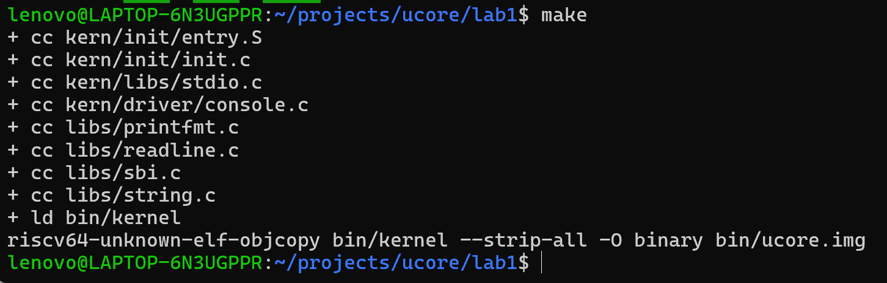
</p>


这说明构建过程依次经历了源码编译、链接以及内核镜像转换

#### 3.2.2 kernel.ld 如何确定内核链接地址和各段布局

`tools/kernel.ld` 是本实验的链接脚本，用于规定内核各部分在地址空间中的组织方式。其中最关键的内容为：
```ld
OUTPUT_ARCH(riscv)
ENTRY(kern_entry)

BASE_ADDRESS = 0x80200000;

SECTIONS {...}
```
`OUTPUT_ARCH(riscv)` 指定输出程序的目标架构为 RISC-V，`ENTRY(kern_entry)` 指定 ELF 文件的入口符号为：`kern_entry`，而`BASE_ADDRESS = 0x80200000`规定整个内核从地址：
`0x80200000`开始布局。链接脚本随后依次定义各个section。

这些段的具体作用是：
| 段 | 主要内容 |
|---|---|
| `.text` | 程序指令，即可执行代码 |
| `.rodata` | 只读数据，例如字符串常量 |
| `.data` | 已初始化的可写全局数据 |
| `.bss` | 未显式初始化、运行前应初始化为 0 的全局/静态数据 |

#### 3.2.3 ELF 文件与裸二进制镜像之间的区别

链接完成后得到`bin/kernel`，使用`file bin/kernel`和`file bin/ucore.img`查看，可以观察到：

<p align="center">
  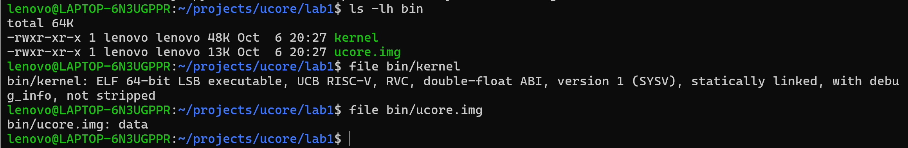
</p>

图片说明 bin/kernel 是一个 RISC-V ELF 可执行文件。ELF 不仅保存实际机器代码和数据，还包含 section、入口地址、符号表和调试信息等结构，因此适合各种工具进行分析调试。

QEMU 在本实验中的启动规则是使用裸二进制镜像。而且Makefile 中定义将 ELF 转换为裸二进制形式。上面图片中`ls -lh bin`显示img文件大小仅13K，同时`file bin/ucore.img`，仅显示：`data`，说明 ucore.img 已不再具有 ELF 文件头、section 表和符号等结构，而主要保留用于实际加载的二进制内容。

#### 3.2.4 为什么 ELF 的入口地址是 0x80200000

使用`riscv64-unknown-elf-readelf -h bin/kernel`，可以查看 ELF 头部信息。

<p align="center">
  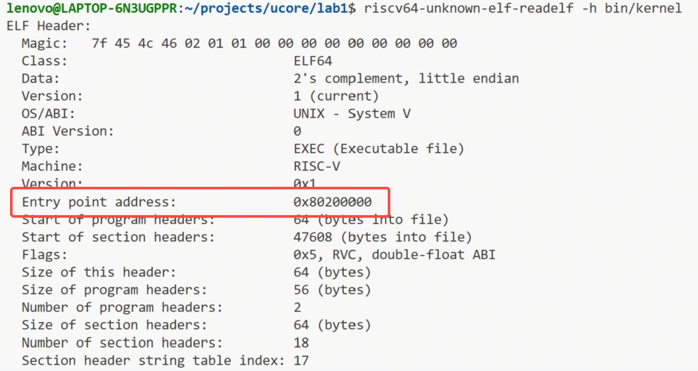
</p>

入口地址之所以为0x80200000，是因为 kernel.ld 中规定：
```ld
ENTRY(kern_entry)
BASE_ADDRESS = 0x80200000;
```
ELF 文件的入口符号为：`kern_entry`。同时通过`riscv64-unknown-elf-nm -n bin/kernel`，可以确认：
`0000000080200000 T kern_entry`

<p align="center">
  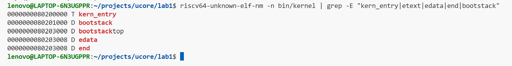
</p>

因此kern_entry = 0x80200000。

ELF 的入口符号为 kern_entry，该符号又位于 0x80200000，最终 ELF 入口地址也就为 0x80200000。

#### 3.2.5 QEMU 如何加载内核镜像
Makefile 中 qemu 目标定义为：

```makefile
qemu: $(UCOREIMG) $(SWAPIMG) $(SFSIMG)
	$(V)$(QEMU) \
		-machine virt \
		-nographic \
		-bios default \
		-device loader,file=$(UCOREIMG),addr=0x80200000
```

其中：`$(QEMU)`默认对应：`qemu-system-riscv64`。`-machine virt` 表示创建一台 RISC-V virt 虚拟机器。`-nographic` 表示不使用图形界面，串口等输出直接显示在终端中。`-bios default` 表示使用 QEMU 默认固件，在本实验实际运行环境中为 OpenSBI。

最关键的是`-device loader,file=$(UCOREIMG),addr=0x80200000`。它表示：QEMU 将 bin/ucore.img 中的裸二进制内容加载到虚拟 RISC-V 机器的 0x80200000 地址。这里与 kernel.ld 中BASE_ADDRESS = 0x80200000的保持一致。

所以在链接阶段，BASE_ADDRESS = 0x80200000，因此bin/kernel 中的 kern_entry = 0x80200000。而在运行阶段，addr = 0x80200000说明bin/ucore.img 被实际加载到该地址。这保证了**内核按照什么地址完成链接，运行时就被加载到什么地址**。

执行`make qemu`后，终端可以看到：

<p align="center">
  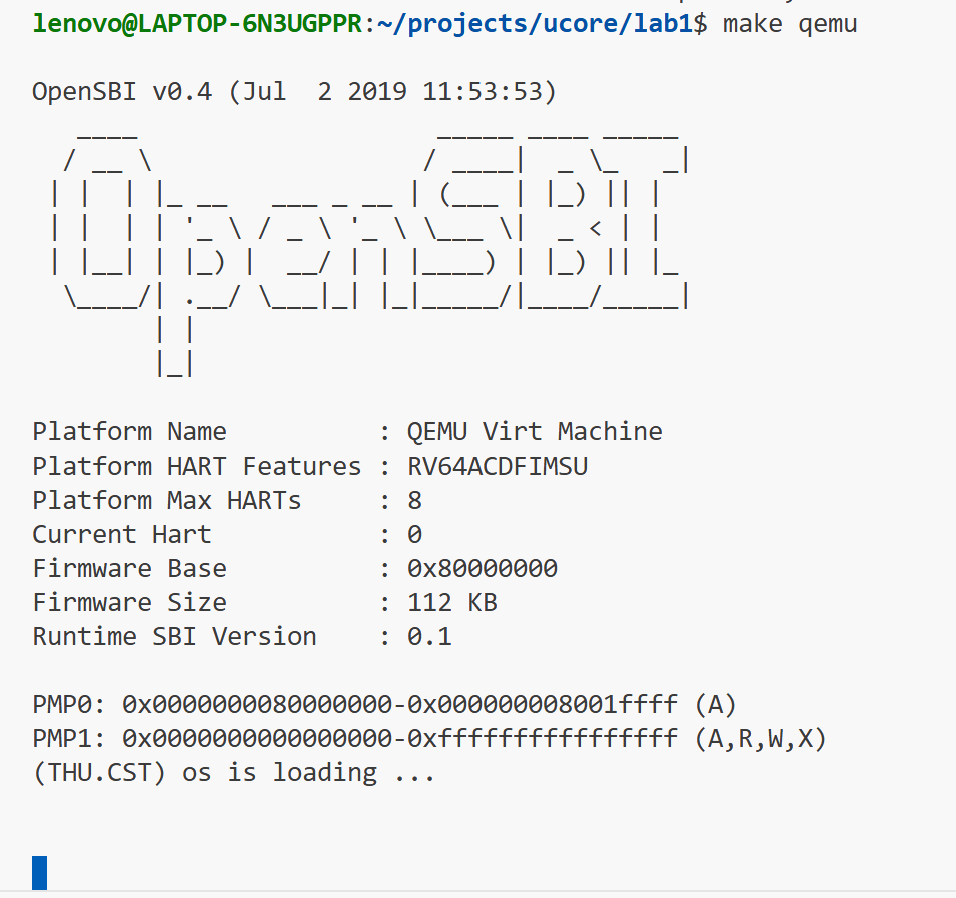
</p>

说明 QEMU 成功创建了 RISC-V 虚拟机、启动了 OpenSBI，并最终使 uCore 内核成功运行。


---

### 3.3 从 CPU 复位到进入 C 内核

**负责人：1号成员 张懿鸾 2413669**

前一阶段已经完成了内核镜像的生成和加载，那么我们应该如何让CPU开始执行这个内核呢？

这一过程可以概括为：

```text
CPU 复位
  ↓
PC = 0x1000
  ↓
QEMU 提供的最初启动代码
  ↓
OpenSBI
  ↓
完成机器级初始化
  ↓
跳转到 0x80200000
  ↓
kern_entry
  ↓
建立内核栈
  ↓
tail kern_init
  ↓
进入 C 语言内核
```

#### 3.3.1 CPU上电

操作系统本身并不存在一个更底层的操作系统替它准备运行环境，因此，CPU 刚启动时不可能直接知道：

```c
int kern_init(void)
```

这个C函数在哪里，更不会自动替它准备：

- 栈；
- 特权级；
- 基本机器环境；
- 固件接口；
- 内核入口地址。

所以，为了让PC开始读指令，我们将一个复位地址赋值给PC，让它从这里开始运行第一条指令。在本实验使用的机器中，GDB 实际也能观察到 CPU 初始停在：

```text
PC = 0x1000
```

这说明 CPU 的第一条执行路径位于 QEMU 构造的机器启动区域，而非 uCore 内核。

因此，启动流程需要经过一个逐层交接过程：

```text
QEMU 虚拟硬件
      ↓
最初启动代码
      ↓
OpenSBI
      ↓
uCore
```

---

#### 3.3.2 OpenSBI

本实验使用 QEMU 4.1.1 时，启动输出可以观察到：

```text
OpenSBI v0.4
Firmware Base          : 0x80000000
```

GDB 中也可以在：

```text
0x80000000
```

观察到 OpenSBI 的执行过程。

因此实际启动过程可以进一步写成：

```text
0x1000
  ↓
QEMU 最初启动代码
  ↓
0x80000000
  ↓
OpenSBI
  ↓
0x80200000
  ↓
uCore kern_entry
```

OpenSBI 运行在 M-mode，而 uCore 之后主要运行在 S-mode。这种设计相当于在硬件与操作系统之间增加了一层统一接口：

```text
硬件 / QEMU
    ↓
OpenSBI
    ↓
操作系统内核
```

这样内核不需要直接处理所有机器级初始化细节，也可以通过 SBI 请求某些底层服务。

---

#### 3.3.3 uCore

在链接阶段，`tools/kernel.ld` 中已经规定：

```ld
OUTPUT_ARCH(riscv)
ENTRY(kern_entry)

BASE_ADDRESS = 0x80200000;
```

其中：

```ld
ENTRY(kern_entry)
```

告诉链接器，内核的入口符号是：

```text
kern_entry
```

而：

```ld
BASE_ADDRESS = 0x80200000;
```

决定内核按照 `0x80200000` 为起始地址进行链接布局。

通过 `readelf` 实际查看生成的 ELF 文件，可以确认：

```text
Machine:                           RISC-V
Entry point address:               0x80200000
```

因此 `0x80200000` 并不是临时决定的地址。`kernel.ld` 负责的是**链接时地址布局**，也就是说
`kernel.ld`决定这个内核会按照`0x80200000` 为起始地址进行链接布局，而QEMU / OpenSBI负责“让 CPU最终真的执行到那里。只有这两个地方的地址相同，内核才能正确运行。

本实验通过 GDB 在：

```text
0x80200000 <kern_entry>
```

成功命中断点，证明启动阶段已经完成了从 OpenSBI 到 uCore 的控制权交接。

---

#### 3.3.4 `kern_entry`

CPU 到达：

```text
0x80200000
```

以后，首先执行的不是：

```c
kern_init()
```

而是：

```asm
kern_entry:
    la sp, bootstacktop
    tail kern_init
```

这是因为 C 函数的正常执行需要一些最基本的运行条件，其中最重要的就是**栈**。

函数调用过程中可能需要使用栈保存：

- 返回地址；
- 保存寄存器；
- 局部变量；
- 临时数据；
- 调用现场。

但 CPU 刚刚从 OpenSBI 进入 uCore 时，内核还没有建立属于自己的栈。因此必须首先使用少量汇编代码完成最基础的运行环境建立，然后才能安全进入 C 语言。


在 `entry.S` 中可以看到：

```asm
.section .data
.align PGSHIFT
.global bootstack

bootstack:
    .space KSTACKSIZE

.global bootstacktop
bootstacktop:
```

其中：

```asm
.space KSTACKSIZE
```

属于汇编器指令，其作用是在生成内核时为启动阶段的内核栈预留 `KSTACKSIZE` 大小的一段空间。因此`bootstack`代表这段空间的起始位置，`bootstacktop`代表这段空间结束后的地址，也就是预留栈空间的顶部。RISC-V 中的栈按照本实验的使用方式从高地址向低地址增长，因此后续初始化时把`sp`设置到`bootstacktop`，把 sp 设置为这块空间的栈顶。

本实验实际 GDB 调试中：

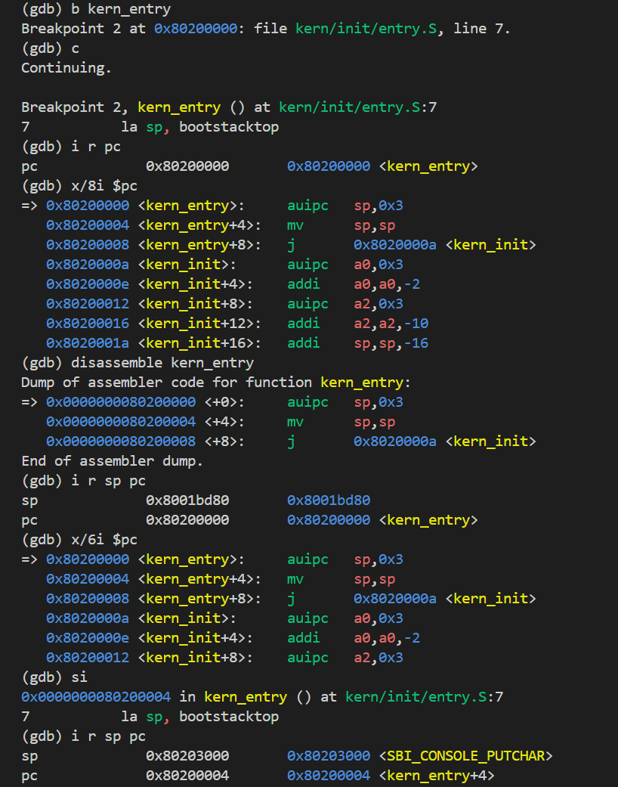

刚刚进入
```text
0x80200000 <kern_entry>
```

时观察到：

```text
sp = 0x8001bd80
```

执行 `la sp, bootstacktop` 后：

```text
sp = 0x80203000
```

这说明在进入自己的内核入口后，主动将启动环境原有的栈指针替换为了自己的内核栈。从这一步开始，后续 C 代码才有了属于内核自己的可靠栈空间。


完成栈初始化后，`entry.S` 的下一条源码为：

```asm
tail kern_init
```

它的目的是把控制权从汇编启动代码交给：

```c
int kern_init(void)
```

实际反汇编中可以看到：

```asm
0x80200008 <kern_entry+8>:
    j 0x8020000a <kern_init>
```

说明这里最终成为一次直接跳转。

使用`tail`而不是像普通函数调用那样保存返回地址，是因为 `kern_entry` 本身只是一个启动阶段入口。它完成建立内核栈以后，任务就已经结束了，后续执行流永久交给`kern_init()`。

因此 `entry.S` 的作用可以概括为：

```text
OpenSBI
   ↓
kern_entry
   ↓
建立内核自己的栈
   ↓
跳入 kern_init
   ↓
进入 C 语言内核
```

---

#### 3.3.5 `kern_init()` 

进入：

```c
int kern_init(void)
```

以后，第一段代码是：

```c
extern char edata[], end[];
memset(edata, 0, end - edata);
```

这里`edata end`来自链接脚本：

```ld
PROVIDE(edata = .);
...
PROVIDE(end = .);
```

因此 C 代码实际上是在引用链接阶段生成的两个地址符号，可以理解为：`edata`是需要清零区域的起始位置，`end`是该区域结束位置。于是`end - edata`就是得到需要初始化的字节数，
而：

```c
memset(edata, 0, end - edata);
```

负责把这段区域初始化为 0。因为在C语言中未显式初始化的全局变量和静态变量，在程序开始运行时应该具有 0 值，内核启动代码需要自己处理。

本实验实际使用 GDB 查看链接符号时得到：

```text
&edata = 0x80203008
&end   = 0x80203008
```

两者地址相同，说明当前这个最小 Lab1 内核中没有实际占用空间的 BSS 数据，因此：

```text
end - edata = 0
```

也就是说本次实际需要清零的字节数为 0。


完成最基本的数据段初始化以后，代码执行：

```c
const char *message = "(THU.CST) os is loading ...\n";
cprintf("%s\n\n", message);
```

如果终端最终能够看到：

```text
(THU.CST) os is loading ...
```

说明整个最小内核启动链已经成功贯通。

```text
QEMU 创建虚拟机
        ↓
CPU 启动
        ↓
OpenSBI 执行
        ↓
进入 0x80200000
        ↓
kern_entry
        ↓
初始化内核栈
        ↓
进入 kern_init
        ↓
执行到 cprintf
```


#### 3.3.6 `while (1)`

完成输出后，`kern_init()` 最终执行：

```c
while (1);
```

`kern_init()` 已经被声明为：

```c
int kern_init(void) __attribute__((noreturn));
```

其中：

```c
__attribute__((noreturn))
```

告诉编译器这个函数按照设计不会正常返回。

```c
while (1);
```

进入无限循环，一方面是因为`kern_init()` 并不是由某个普通 C 函数调用进来的，它前面并不存在一个“操作系统外层程序”等待它返回。如果 `kern_init()` 意外返回，CPU 会进入一个没有定义好返回目标的状态。另一方面，如果操作系统功能完善的话，会有内存管理或者管理其他进程，所以操作系统应该一直处于运行状态，等待中断或者异常让其跳出死循环。

#### 3.3.7 整体理解

经过源码分析和 GDB 实际观察后，我认为从 CPU 复位到进入 C 内核这一阶段可以归纳成：

```text
CPU 复位
  ↓
PC = 0x1000
  ↓
执行 QEMU 提供的最初启动代码
  ↓
进入 0x80000000 的 OpenSBI
  ↓
OpenSBI 完成底层初始化
  ↓
将控制权交给 0x80200000
  ↓
kern_entry
  ↓
la sp, bootstacktop
  ↓
sp 从启动环境的值切换为 uCore 自己的栈顶
  ↓
tail kern_init
  ↓
进入 0x8020000a <kern_init>
  ↓
根据 edata/end 初始化 BSS
  ↓
cprintf 输出启动信息
  ↓
while (1)
```

一个操作系统内核必须自己逐层建立运行条件：先获得 CPU 控制权，再建立自己的执行环境，再初始化 C 语言所依赖的数据状态，最后才能开始执行普通的 C 内核逻辑。Lab1已经成功展示了操作系统启动过程中最基础的几个问题：CPU 从哪里开始执行；固件和内核如何交接控制权；内核的链接地址和实际执行地址如何对应；为什么进入 C 函数以前必须建立栈；C 运行环境中的 BSS 为什么需要由内核自行初始化；一个没有上层程序可以返回的内核入口为什么必须保证不返回。


---

### 3.4 从 `cprintf()` 到 SBI 控制台输出

**负责人：2号成员 张祎然 2412419**

本节接续 3.3 中 `kern_init()` 调用 `cprintf("%s\n\n", message)` 的位置，分析格式串如何转换为字符序列，以及字符如何通过控制台接口和 SBI 服务输出至 QEMU 终端。

#### 3.4.1 本实验为何使用内核自己的 `cprintf`

本工程使用课程提供的 `kern/libs/stdio.c`、`libs/printfmt.c` 等库代码，构建选项包含 `-nostdinc` 和 `-nostdlib`，并未链接普通用户程序使用的标准 C 库。因此，本实验的输出不是直接调用宿主系统的 `printf`，而是由内核自己的 `cprintf` 解析格式串，再通过逐字符输出接口请求底层服务。

#### 3.4.2 模块职责、格式化与控制台接口

本模块涉及 `kern/init/init.c`、`kern/libs/stdio.c`、`libs/printfmt.c`、`kern/driver/console.c` 和 `libs/sbi.c`。启动代码发起如下调用：

```c
const char *message = "(THU.CST) os is loading ...\n";
cprintf("%s\n\n", message);
```

源码层面的调用关系为：

```text
kern_init → cprintf → vcprintf → vprintfmt
         → cputch → cons_putc → sbi_console_putchar
         → sbi_call → ecall → OpenSBI → 模拟串口
```

`cprintf(const char *fmt, ...)` 提供可变参数接口，通过 `va_list` 访问格式串之外的参数。`vcprintf(const char *fmt, va_list ap)` 建立输出计数，并将 `cputch` 作为回调交给格式化函数。`vprintfmt` 解析格式串，在 `%s` 分支中获取字符串指针并逐字符处理，直至遇到终止符 `\0`；字符输出由函数指针回调完成，不直接操作硬件。

`cputch(int c, int *cnt)` 调用控制台输出接口并增加计数；`cons_putc(int c)` 将字符转换为 `unsigned char` 后，传给 `sbi_console_putchar(unsigned char ch)`。后者调用 `sbi_call(SBI_CONSOLE_PUTCHAR, ch, 0, 0)`。本次服务编号变量的值为 1，对应旧版 SBI Console Putchar 服务。

本次参与输出的主要函数签名为：

```c
int cprintf(const char *fmt, ...);
int vcprintf(const char *fmt, va_list ap);
void vprintfmt(void (*putch)(int, void *),
              void *putdat, const char *fmt, va_list ap);
static void cputch(int c, int *cnt);
void cons_putc(int c);
void sbi_console_putchar(unsigned char ch);
uint64_t sbi_call(uint64_t sbi_type, uint64_t arg0,
                  uint64_t arg1, uint64_t arg2);
```

`cputch` 是 `stdio.c` 中的静态函数。`vprintfmt` 以 `void *` 传递回调上下文，`cputch` 将其作为计数器地址使用。源码层面的多层调用不一定在优化后保留独立函数：本次反汇编显示，`vcprintf` 已内联至 `cprintf`，`sbi_call` 已内联至 `sbi_console_putchar`，最终符号表中不再保留这两个函数的独立符号。

关键实现摘录如下：

```c
static void cputch(int c, int *cnt) {
    cons_putc(c);
    (*cnt)++;
}
```

```c
int vcprintf(const char *fmt, va_list ap) {
    int cnt = 0;
    vprintfmt((void *)cputch, &cnt, fmt, ap);
    return cnt;
}
```

```c
void cons_putc(int c) {
    sbi_console_putchar((unsigned char)c);
}
```

```c
void sbi_console_putchar(unsigned char ch) {
    sbi_call(SBI_CONSOLE_PUTCHAR, ch, 0, 0);
}
```

SBI、OpenSBI 与 QEMU 分别承担接口规范、固件实现和硬件模拟的职责。内核完成格式串处理后，通过 SBI 请求 OpenSBI 输出字符，再由 QEMU 模拟的串口将结果显示至终端。

`cprintf` 通过 `va_start(ap, fmt)` 初始化可变参数访问状态，再将格式串和参数列表传给 `vcprintf`。本项目的 `va_list` 及相关宏由编译器内建机制提供。`vcprintf` 将计数器 `cnt` 初始化为 0，并将其地址作为回调上下文传给 `vprintfmt`。

`vprintfmt` 逐字符解析格式串：普通字符直接交给 `putch`，遇到 `%` 时根据后续字符选择处理分支。本次格式串为 `"%s\n\n"`，程序在 `%s` 分支中通过 `va_arg(ap, char *)` 获取 `message` 地址并扫描消息字符串，随后处理格式串中的两个换行。字符串终止符 `\0` 仅用于结束扫描，不传给输出回调。

`cputch` 每接收一个字符，先调用 `cons_putc`，再执行 `(*cnt)++`。因此，格式化函数负责生成字符序列，回调函数负责输出与计数，SBI 封装负责提交单字符请求。启动消息中的换行同样经过该路径。源码还包含 `%c`、整数及宽度等处理分支，但本次动态验证仅覆盖 `%s` 和普通换行。

`cputchar(int c)` 直接输出单个字符，`cputs(const char *str)` 输出字符串并追加一个换行。二者与 `cprintf` 共用底层字符输出接口，但不承担格式串解析功能。本次启动代码调用的是 `cprintf`，未单独测试这两个接口。


#### 3.4.3 SBI 封装与寄存器传参

`libs/sbi.c` 中的 `sbi_call` 将 C 参数转换为旧版 SBI 调用所要求的寄存器内容。源码核心如下：

```c
__asm__ volatile (
    "mv x17, %[sbi_type]\n"
    "mv x10, %[arg0]\n"
    "mv x11, %[arg1]\n"
    "mv x12, %[arg2]\n"
    "ecall\n"
    "mv %[ret_val], x10"
    : [ret_val] "=r" (ret_val)
    : [sbi_type] "r" (sbi_type), [arg0] "r" (arg0),
      [arg1] "r" (arg1), [arg2] "r" (arg2)
    : "memory"
);
```

`x17`、`x10`、`x11`、`x12` 的 ABI 名称分别为 `a7`、`a0`、`a1`、`a2`。前四条指令分别将服务编号写入 `a7`、将参数写入 `a0` 至 `a2`，随后通过 `ecall` 提交请求，最后从 `a0` 读取底层返回值。`"r"` 表示输入操作数由编译器分配寄存器，`"=r"` 表示输出操作数写入寄存器；命名操作数用于建立 C 变量与汇编模板的对应关系。

`volatile` 用于标识具有外部作用的内联汇编，避免编译器将其作为无用代码删除；`"memory"` 声明该汇编可能影响内存。后者是编译器约束，并非硬件 `fence` 指令，也不能替代寄存器修改的约束声明。本次未修改该封装，主要通过反汇编及寄存器结果验证参数传递。

`SBI_CONSOLE_PUTCHAR` 在源码中被定义为值为 1 的 `uint64_t` 全局变量，而非宏。反汇编显示，程序先从该变量地址读取服务编号 1，再写入 `a7`；变量地址与其保存的服务编号具有不同含义。

#### 3.4.4 `ecall`、S-mode 与 M-mode 的关系

本次内核运行于 S-mode，OpenSBI 运行于 M-mode。内核先按照旧版 SBI 约定设置服务编号和参数，再执行 `ecall` 发起环境调用。该过程是内核向固件请求服务，不是用户程序通过系统调用进入内核。

对本次 Console Putchar 调用，`a7=1` 表示字符输出服务，`a0` 保存待输出的字符值，`a1` 和 `a2` 为 0，不通过 `a6` 选择函数。`ecall` 本身不负责解析格式串，也不直接传递整条字符串；完整消息由多次单字符输出组成。

执行 `ecall` 后，控制权转入 OpenSBI 的异常处理路径。`mcause=9`、`mepc` 保存 `ecall` 地址，返回断点则确认内核在该指令的下一条指令处恢复执行。异常入口、单步实际停点与内核返回位置不是同一个地址。

#### 3.4.5 输入接口的源码现状与验证范围

源码中的输入调用关系为 `readline → getchar → cons_getc → sbi_console_getchar`。`readline` 通过缓冲区保存一行输入，`getchar` 循环调用 `cons_getc`，后者调用 SBI 输入封装。

当前 `libs/sbi.h` 仅声明 `sbi_console_getchar`，`libs/sbi.c` 虽定义了值为 2 的输入服务编号，但未提供该函数的实现。由于 `kern_init` 未调用输入函数，本次验证范围仅包括启动与输出，未进行输入测试。

Makefile 使用 `-ffunction-sections`、`-fdata-sections` 和 `--gc-sections`，未被引用的输入函数及相关数据在链接时被移除。本次最终符号表中不包含 `getchar`、`cons_getc` 和 `readline`，因此输入封装缺少实现未影响当前内核的链接。

## 四、实验内容与实现

### 练习1：理解内核启动中的程序入口操作

**负责人：** 1号 张懿鸾 2413669

`kern/init/entry.S` 的核心代码为：

```asm
kern_entry:
    la sp, bootstacktop
    tail kern_init
```

#### 1. `la sp, bootstacktop` 完成了什么操作？目的是什么？


在 `entry.S` 中：

```asm
bootstack:
    .space KSTACKSIZE
...
bootstacktop:
```

已经提前为内核启动阶段预留了一段栈空间。

`la` 是加载地址的伪指令。

```asm
la sp, bootstacktop
```

将符号 `bootstacktop` 对应的地址加载到 RISC-V 的栈指针寄存器 `sp` 中，`.space KSTACKSIZE`
负责“准备一块可以作为栈使用的内存”,`la sp, bootstacktop`负责“告诉 CPU 当前内核栈顶在哪里.
本实验中栈从高地址向低地址增长，因此把 `sp` 初始化为 `bootstacktop` 后，后续函数调用就可以使用这块内核栈保存返回信息、局部数据和调用现场。

它的根本目的，是在进入 C 语言函数以前，先建立最基本的 C 函数运行环境。

#### 2. `tail kern_init` 完成了什么操作？目的是什么？

```asm
tail kern_init
```

将执行流程直接转移到 C 语言函数：

```c
int kern_init(void);
```

此时 `entry.S` 已经完成了初始化内核栈，因此接下来的初始化逻辑可以交给更容易组织的 C 代码。

这里使用 `tail` 的意义在于：`kern_entry` 只是启动阶段由汇编语言进入C语言的入口，并不需要等待 `kern_init()` 执行完成后再返回。而 `kern_init()` 本身被声明为：

```c
__attribute__((noreturn))
```

并在最后执行：

```c
while (1);
```

按照完整的操作系统理论，在执行完初始化之后，应该进入内存管理、虚拟内存等等更多功能的使用阶段，死循环就是为了保证操作系统一直在运行，除非在执行过程中遇到异常或者中断而退出，所以正常流程本来就不会回到 `kern_entry`。

#### 3. GDB 验证

为了验证上述分析，可以使用 GDB 实际观察 `kern_entry` 执行过程中 `sp` 和 `pc` 的变化。

在 `kern_entry` 处停止时，本实验观察到：

```text
pc = 0x80200000 <kern_entry>
sp = 0x8001bd80
```

执行 `la sp, bootstacktop` 对应的机器指令以后：

```text
sp = 0x80203000
```

进一步查询：

```gdb
p/x &bootstacktop
```

可以确认 `bootstacktop` 的地址与新的 `sp` 相同，从而证明 `la sp, bootstacktop` 确实完成了内核栈初始化。


反汇编还可以观察到：

```asm
0x80200008 <kern_entry+8>:
    j 0x8020000a <kern_init>
```

继续执行后，PC 到达：

```text
0x8020000a <kern_init>
```

说明 `tail kern_init` 成功将控制权交给 C 语言函数 `kern_init()`。

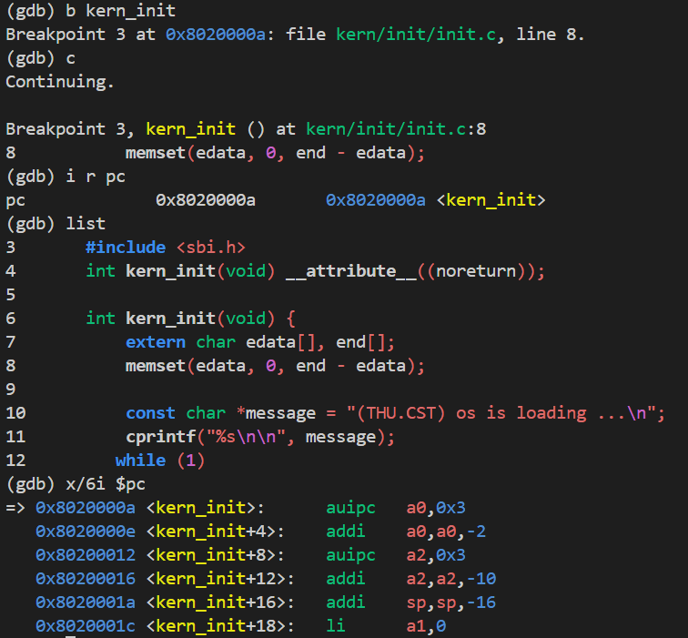

由此，GDB 实验结果与对 `entry.S` 两条关键语句的分析相符：

```text
la sp, bootstacktop
        ↓
建立内核栈

tail kern_init
        ↓
进入 C 语言内核初始化函数
```

---

### 练习2：使用 GDB 验证 RISC-V 启动流程

**负责人：** 3号 张旗庭 2413788

本练习使用 QEMU 与 GDB 对 RISC-V 虚拟机从复位开始到进入 uCore 内核入口的过程进行跟踪。与普通应用程序不同，操作系统内核并不是由另一个操作系统直接调用，而需要经历处理器复位、固件初始化以及控制权交接等阶段。

本实验重点验证的启动路径为：

```text
CPU 复位
    ↓
PC = 0x1000
    ↓
QEMU 复位 ROM 中的启动指令
    ↓
0x80000000
    ↓
OpenSBI
    ↓
0x80200000
    ↓
kern_entry
```

其中，`0x1000` 是本实验中 QEMU RISC-V virt 机器的复位入口；`0x80000000` 为 OpenSBI 固件所在位置；`0x80200000` 则是 uCore 内核的链接地址和入口地址。

#### 1.启动 QEMU 调试环境并连接 GDB

首先在一个终端中执行：
```bash
make debug
```

由于Makefile 中的 debug 目标在普通 QEMU 启动参数后增加了`-s -S`，

```makefile
debug: $(UCOREIMG) $(SWAPIMG) $(SFSIMG)
	$(V)$(QEMU) \
		-machine virt \
		-nographic \
		-bios default \
		-device loader,file=$(UCOREIMG),addr=0x80200000\
		-s -S
```

其中
- `-S` 使 QEMU 启动后暂时停止 CPU 执行；
- `-s` 启动 GDB 远程调试接口，默认监听 localhost:1234。

因此执行 make debug 后，QEMU 虽然已经建立虚拟机，但 CPU 暂停等待调试器连接，终端中暂时没有反应。

随后在第二个终端中执行：
```bash
make gdb
```
根据Makefile，实际执行的是：
```makefile
riscv64-unknown-elf-gdb \
    -ex 'file bin/kernel' \
    -ex 'set arch riscv:rv64' \
    -ex 'target remote localhost:1234'
```
其中 `file bin/kernel` 用于加载 ELF 文件中的符号和调试信息，`set arch riscv:rv64` 指定目标架构为 64 位 RISC-V，`target remote localhost:1234` 则连接正在运行的 QEMU。

执行结果如下：
<p align="center">
  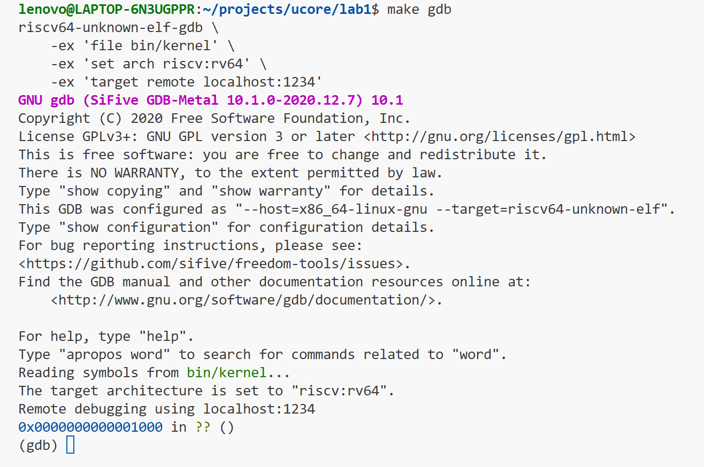
</p>

连接成功后，GDB 显示`0x0000000000001000 in ?? ()`，说明 CPU 当前停在地址 0x1000。

#### 2.观察 CPU 复位后的第一段指令

GDB 连接 QEMU 后，首先执行：`i r pc`，观察当前程序计数器 PC，结果为：`pc = 0x1000`，说明在本实验的 QEMU RISC-V virt 环境中，CPU 复位后首先停在地址 `0x1000`。

随后执行：`x/10i $pc`，从当前 PC 开始，反汇编显示10条指令，结果如下：

<p align="center">
  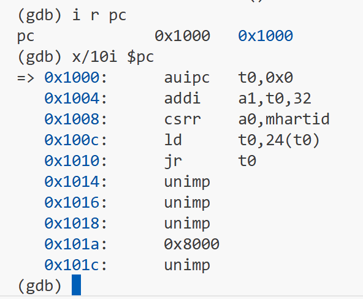
</p>

其中前五条为启动阶段实际执行的关键指令。
```asm
0x1000: auipc t0,0x0      
0x1004: addi  a1,t0,32    
0x1008: csrr  a0,mhartid  
0x100c: ld    t0,24(t0)   
0x1010: jr    t0          
```

具体的指令解释：
- 0x1000: auipc t0,0x0：将复位代码所在位置 0x1000 保存到 t0，后面的指令会用它作为基址计算启动参数和下一阶段入口地址。这条指令执行后`t0 = 0x1000`，`pc = 0x1004`
- 0x1004: addi a1,t0,32：这条指令计算`a1 = t0 + 32`，执行后`a1 = 0x1020`，`pc = 0x1008`。这里的 a1 是传给下一阶段启动代码的参数之一。
- 0x1008: csrr  a0,mhartid:`csrr` 是读取 CSR，也就是 RISC-V 的控制和状态寄存器。`mhartid`表示当前 hart 的编号。这一步执行后：a0 = hart 编号。
- 0x100c: ld t0,24(t0)：t0 = 0x1000，于是0x1000 + 24= 0x1018，所以这条指令从内存地址 0x1018 读取一个 64 位数值，并放入 t0。通过后续我们知道`t0 = 0x80000000`。
- 0x1010: jr t0:跳转到 t0 中保存的地址:0x80000000。CPU 正式离开 QEMU 的复位启动代码，进入 OpenSBI。


之后用`si`单步执行，`i r t0` 查看寄存器t0当前的值， `i r pc` 查看程序计数器pc当前的值。

在单步执行至 `0x1010` 前，本实验观察到：`t0 = 0x80000000`，再次si单步执行，发现后，PC 从：`0x1010`，转移到：`0x80000000`。这一步执行的命令是：`jr t0`。这一步**说明 CPU 已经从 QEMU 复位 ROM 进入 OpenSBI 固件**。

<p align="center">
  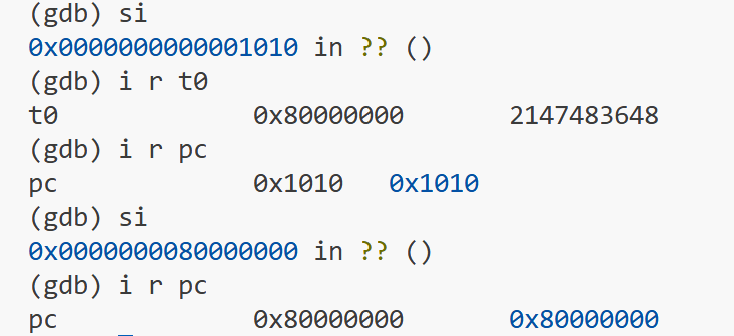
</p>

#### 3.单步进入 OpenSBI

执行
```
si
i r pc
```

观察到：`pc = 0x80000000`。与 QEMU 启动时显示的：`Firmware Base : 0x80000000`相对应。

OpenSBI 运行在更底层的机器模式中，负责完成机器级初始化，并在启动过程结束后将控制权交给操作系统内核。因此当前启动过程已经可以确认前两阶段：从CPU复位到QEMU 复位启动代码，然后进入OpenSBI。

#### 4.验证进入 uCore 内核入口

为了直接观察 OpenSBI 最终是否将控制权交给 uCore，在 GDB 中设置断点：
```
b *0x80200000
```
程序继续执行后，GDB 成功停止在：`Breakpoint 1, kern_entry () at kern/init/entry.S`，并观察到：`pc = 0x80200000`。

<p align="center">
  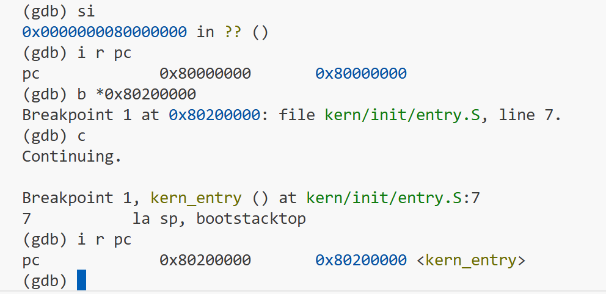
</p>

由于 tools/kernel.ld 中规定：
```ld
ENTRY(kern_entry)
BASE_ADDRESS = 0x80200000;
```
而前面的 readelf 与 nm 检查也表明：
```txt
Entry point address = 0x80200000
kern_entry = 0x80200000
```
因此该断点的成功命中说明 CPU 已经真正进入 uCore 内核入口。

#### 5.练习问题回答

**（1）RISC-V 硬件加电后最初执行的几条指令位于什么地址？**

通过 GDB 调试可以观察到，CPU 复位后程序计数器 PC 的初始值为：

```text
0x1000
```
因此，在本实验使用的 QEMU RISC-V virt 环境中，CPU 上电后首先从 0x1000 开始执行。该地址是 QEMU 提供的复位启动代码所在位置。

**（2）它们主要完成了哪些功能？**
在 0x1000 处反汇编得到：
```asm
0x1000: auipc t0,0x0
0x1004: addi  a1,t0,32
0x1008: csrr  a0,mhartid
0x100c: ld    t0,24(t0)
0x1010: jr    t0
```
这些指令主要准备启动参数，以及获取OpenSBI 入口地址，然后跳转到 0x80000000。由逐步调试结果可以看出。

#### 6.实验结论

通过 QEMU + GDB 单步调试，本实验实际观察到了 RISC-V 从复位到进入 uCore 内核入口的完整启动路径。

其中，0x1000 为 CPU 复位后的初始执行地址，复位代码通过读取下一阶段入口并执行跳转，进入 0x80000000 的 OpenSBI；OpenSBI 完成机器级初始化后，最终将控制权交给位于 0x80200000 的 uCore 内核入口。 kernel.ld 中定义的链接地址、ELF 文件的入口地址以及 GDB 中实际观察到的运行地址相互对应，从而验证了本实验中 RISC-V 的启动过程。


## 五、测试与验证

本组规划是要求三位成员分别完成一次 QEMU 运行与 GDB 调试，以实际运行结果验证对 RISC-V 启动过程的理解。

由于第三部分已经对启动过程进行了详细分析，本节主要记录各成员实际完成实验后的运行结果和调试截图，不再重复展开原理说明。

---

### 5.1 1号成员测试与验证

**成员：** 张懿鸾 2413669

本人完成了 Lab1 的编译运行以及从 CPU 复位入口到 uCore 内核入口的 GDB 调试。

#### 1. QEMU 正常启动

执行：

```bash
make qemu
```

内核能够正常启动，并最终输出：

```text
(THU.CST) os is loading ...
```

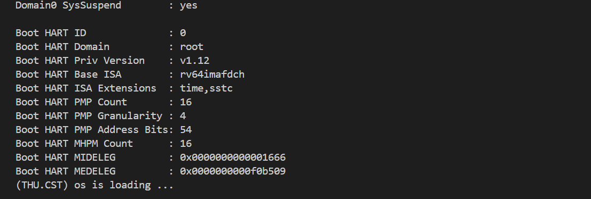

#### 2. ELF 内核入口验证

使用 `readelf` 查看生成的 `bin/kernel`，可以确认目标架构为 RISC-V，程序入口地址为：

```text
0x80200000
```

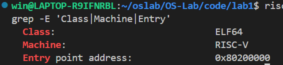

#### 3. GDB 观察 CPU 复位入口

通过 `make debug` 启动暂停状态下的 QEMU，并使用 `make gdb` 连接后，可以观察到 CPU 初始 PC 为：

```text
0x1000
```

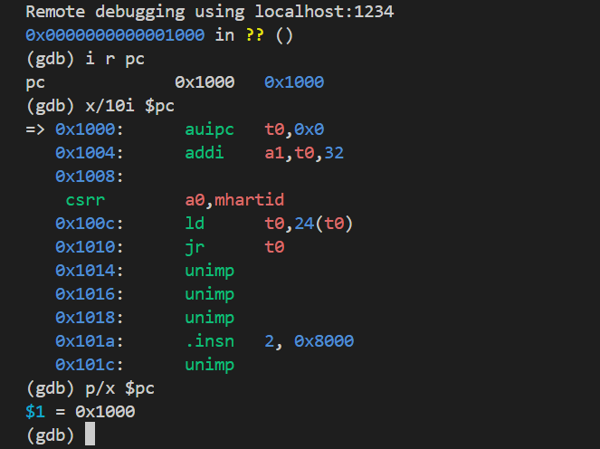

#### 4. GDB 观察 OpenSBI

继续调试启动过程，可以观察到程序进入：

```text
0x80000000
```

对应 OpenSBI 固件所在的地址。

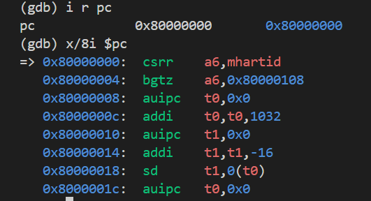

#### 5. GDB 进入 uCore 内核入口

在 `kern_entry` 设置断点并继续运行后，GDB 成功停在：

```text
0x80200000 <kern_entry>
```

说明启动阶段已经完成从 OpenSBI 到 uCore 内核入口的控制权交接。

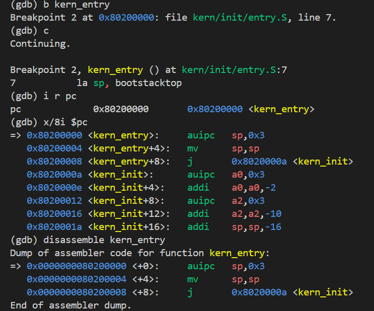

通过以上实验，可以实际观察到：

```text
0x1000
  ↓
0x80000000
  ↓
0x80200000 <kern_entry>
```

与第三部分分析的启动流程一致。

> `la sp, bootstacktop` 对内核栈的初始化以及 `tail kern_init` 进入 C 语言函数的 GDB 验证已经在练习1中给出，此处不再重复展示。

---

### 5.2 2号成员测试与验证

**成员：** 张祎然 2412419

独立完成 QEMU 运行与启动流程 GDB 调试，并结合负责的输出模块检查格式串、首字符、SBI 参数、异常进入与返回位置，以及整条消息的输出计数。以下观察与地址对应此次构建；重新编译或更换工具链后，应先核对当前反汇编再使用绝对地址断点。


#### 5.2.1 QEMU 版本检查与正常运行

QEMU 4.1.1 独立安装于 `~/lab1-tools/qemu-4.1.1-install`。安装后，通过该目录下的版本命令确认安装结果：

```bash
"$HOME/lab1-tools/qemu-4.1.1-install/bin/qemu-system-riscv64" --version
```

版本命令输出 `QEMU emulator version 4.1.1`。

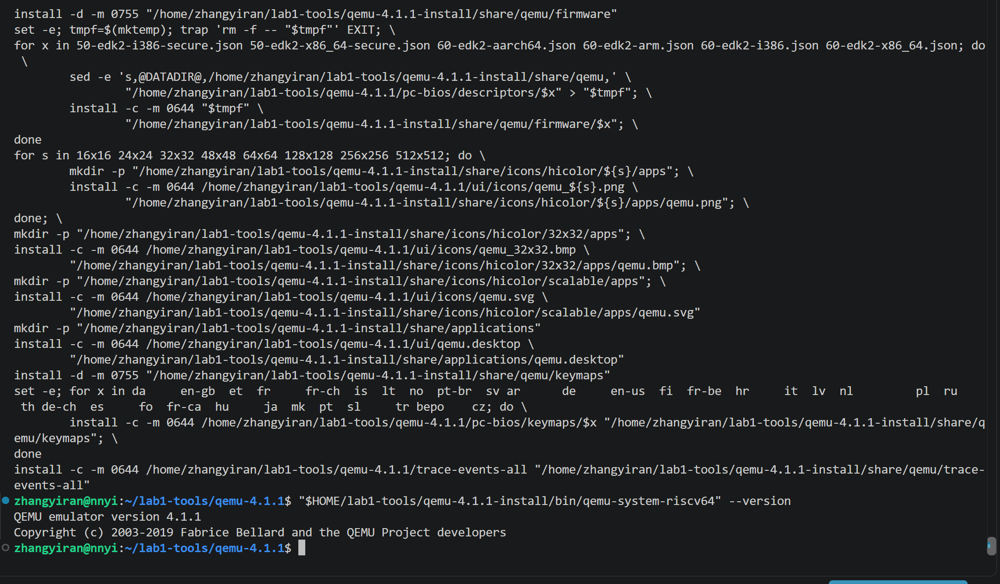

图5.2-1 QEMU 4.1.1 安装结束及独立路径版本检查

进入实际编译目录后，在 WSL 终端执行：

```bash
export PATH="$HOME/lab1-tools/qemu-4.1.1-install/bin:$PATH"
hash -r
qemu-system-riscv64 --version
make
make qemu
```

本次 `make` 输出 `Nothing to be done for 'TARGETS'`，表示按当前构建规则无需更新目标文件。随后使用已有内核镜像运行。

用课程原始 Makefile，`qemu` 和 `debug` 目标使用 `-bios default`，并通过 `-device loader,file=$(UCOREIMG),addr=0x80200000` 加载内核镜像。图5.2-2显示 QEMU 4.1.1、OpenSBI v0.4、Runtime SBI Version 0.1，以及末尾的 `(THU.CST) os is loading ...`。启动消息输出后，当前内核进入无限循环，不提供交互式 shell。

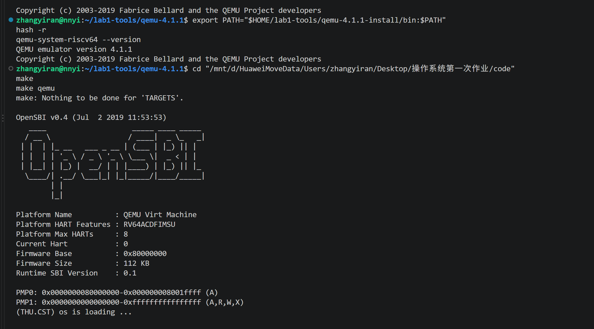

图5.2-2 QEMU 4.1.1 配合课程原始启动参数运行成功

#### 5.2.2 启动调试并连接目标

在第一个 WSL 终端进入本人实际编译目录，并执行：

```bash
export PATH="$HOME/lab1-tools/qemu-4.1.1-install/bin:$PATH"
hash -r
qemu-system-riscv64 --version
make debug
```

在第二个 WSL 终端进入同一代码目录并执行 `make gdb`。Makefile 启动 `riscv64-unknown-elf-gdb`，加载 `bin/kernel`，设置 `riscv:rv64` 架构，并连接 `localhost:1234`。

QEMU 终端负责运行模拟机器并显示输出，GDB 终端负责断点、单步和寄存器查询。下列调试命令均在 `(gdb)` 提示符下输入。

#### 5.2.3 检查复位 PC 和最初的指令

在 GDB 中执行：

```gdb
set pagination off
info registers pc
x/8i $pc
```

实测 `pc=0x1000`。QEMU 4.1.1 下，复位代码共有以下五条启动指令：

```asm
0x1000: auipc t0,0x0
0x1004: addi  a1,t0,32
0x1008: csrr  a0,mhartid
0x100c: ld    t0,24(t0)
0x1010: jr    t0
```

第一条指令将当前 PC 值 `0x1000` 写入 `t0`；第二条计算设备树地址 `0x1020` 并写入 `a1`；第三条将当前硬件线程编号读入 `a0`；第四条从 `0x1018` 读取固件跳转地址并写入 `t0`；第五条跳转至 `t0` 指定的地址。设备树用于描述模拟平台的硬件，hart 表示硬件线程。

此时执行的是 QEMU virt 的复位 ROM。由于加载的内核 ELF 不包含该地址范围对应的函数符号，GDB 显示 `??`。`x/8i` 将五条启动指令之后的填充及地址数据继续按指令反汇编，因而显示 `unimp`。这些位置尚未被 CPU 执行，该显示结果不构成非法指令异常已经发生的依据。

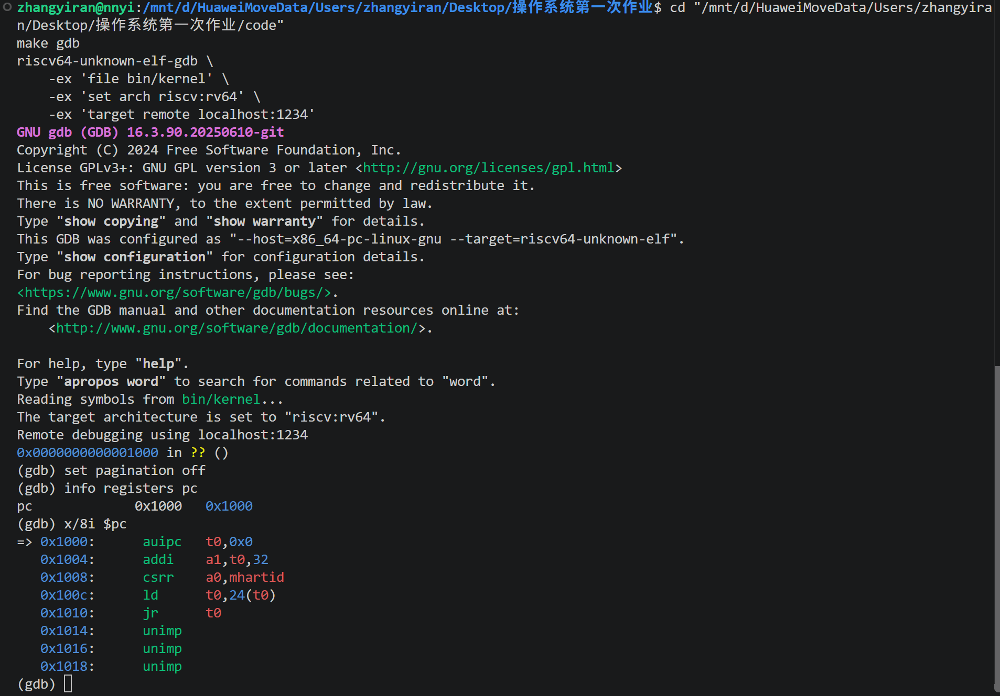

图5.2-3 QEMU 4.1.1 下的复位 PC 和五条启动指令

本次复位代码的跳转指令位于 `0x1010`。根据该反汇编结果，先执行 `si 4` 检查跳转前参数，再执行一次 `si` 观察控制权转移。

#### 5.2.4 单步进入 OpenSBI

保持当前会话，执行：

```gdb
si 4
info registers pc t0 a0 a1
x/i $pc
si
info registers pc
x/5i $pc
```

执行前四条指令后，`pc=0x1010`，当前指令为尚未执行的 `jr t0`。此时 `t0=0x80000000`、`a0=0`、`a1=0x1020`，分别表示固件跳转目标、hart 0 及设备树地址。

再执行一次 `si` 后，`pc=0x80000000`，表明 CPU 已进入 OpenSBI。固件入口的指令为：

```asm
0x80000000: csrr  a6,mhartid
0x80000004: bgtz  a6,0x80000108
0x80000008: auipc t0,0x0
0x8000000c: addi  t0,t0,1032
0x80000010: auipc t1,0x0
```

第一条指令读取硬件线程编号，第二条据此进行条件分支。上述指令属于 OpenSBI 的初始化过程，固件向内核移交控制权的结果在下一步通过内核入口断点验证。

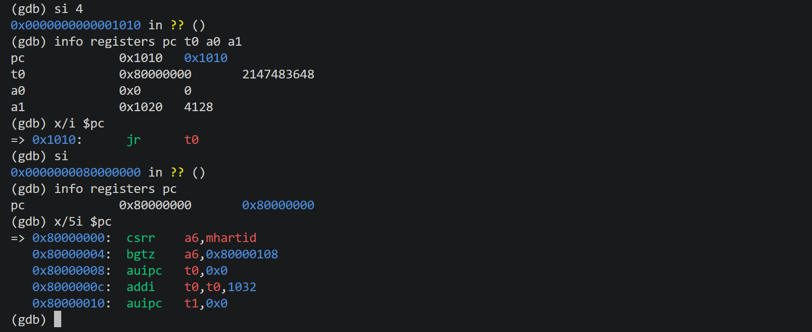

图5.2-4 QEMU 4.1.1 下的复位参数与进入 OpenSBI

#### 5.2.5 命中内核入口

在 OpenSBI 入口暂停时执行：

```gdb
break *kern_entry
continue
info registers pc sp
x/3i $pc
p/x &bootstacktop
```

断点命中 `kern_entry`，对应 `kern/init/entry.S:7` 的 `la sp, bootstacktop`，此时 `pc=0x80200000`、`sp=0x8001bd80`。由于入口第一条指令尚未执行，`sp` 仍保留固件阶段的值。该断点命中表明控制权已从 OpenSBI 转移至内核入口。

入口反汇编为：

```asm
0x80200000: auipc sp,0x3
0x80200004: mv    sp,sp
0x80200008: j     0x8020000a <kern_init>
```

第一条指令按当前 PC 加 `0x3000` 计算地址；第二条为零偏移加法的反汇编别名，本次执行不再改变 `sp`；第三条直接跳转至 C 初始化函数。

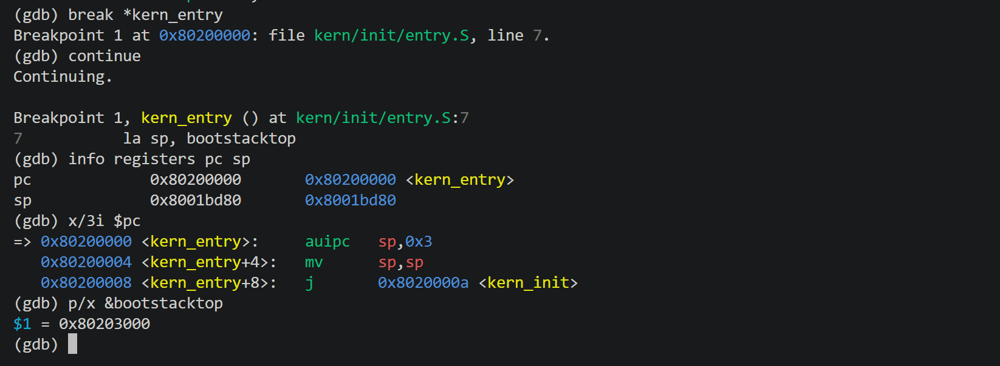

图5.2-5 命中内核入口并查看实际机器指令

#### 5.2.6 验证栈初始化并进入 C 函数

接着执行：

```gdb
si 2
info registers pc sp
p/x &bootstacktop
si
info registers pc sp
```

执行前两条机器指令后，`pc=0x80200008`、`sp=0x80203000`，与查询得到的 `bootstacktop` 地址一致，表明栈指针设置完成。再执行一次 `si` 后，`pc=0x8020000a`，程序进入 `kern_init`，此时 `sp` 仍为 `0x80203000`。

GDB 在 `sp` 的数值后标注了 `<SBI_CONSOLE_PUTCHAR>`。符号表显示，该全局变量与栈顶标签均对应地址 `0x80203000`。栈空间为 `[0x80201000, 0x80203000)`，不包含上界，且向低地址增长，因此与该变量不存在存储空间重叠。该符号标注表示地址对应关系，不表示 `sp` 保存服务编号 1。

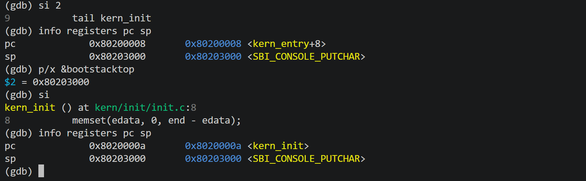

图5.2-6 栈指针与栈顶一致并进入 kern_init

`kern_init` 首先执行 `memset(edata, 0, end - edata)`，随后输出启动消息。`edata` 和 `end` 为链接脚本定义的边界；本次符号表及反汇编显示，两者均为 `0x80203008`，因此清零长度为 0。代码保留了 BSS 清零步骤，但当前构建不存在需要清零的非空 BSS。函数入口处的源码行显示仅用于定位，不表示 `memset` 已执行完毕。

反汇编显示，`kern_init` 在 `0x8020001a` 执行 `addi sp,sp,-16`，随后保存 `ra`，验证了 C 函数对已初始化栈的使用。对构建文件的静态检查表明，本次 ELF 的 `.data` 为 8192 字节栈空间，其后的 `.sdata` 为 8 字节服务编号变量。`readline.c` 中的 1024 字节静态缓冲区因对应输入代码未被引用，已由链接器移除，详见 3.4.5 节。

#### 5.2.7 检查 `cprintf` 的格式串和消息

从 `kern_init` 入口继续调试，执行：

```gdb
break *cprintf
continue
info registers pc a0 a1
x/s $a0
x/s $a1
```

`break *cprintf` 将断点设在函数的机器入口，以便在参数寄存器被后续指令复用前检查输入。`info registers` 用于读取寄存器值，`x/s` 则将寄存器值作为地址读取字符串。

断点处 `pc=0x80200054`、`a0=0x802004c8`、`a1=0x802004a8`。执行 `x/s $a0` 得到 `"%s\n\n"`，执行 `x/s $a1` 得到 `"(THU.CST) os is loading ...\n"`。这表明 `a0` 和 `a1` 分别保存格式串与消息字符串的地址，而非字符串内容本身。

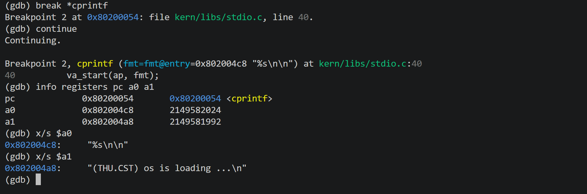

图5.2-7 cprintf 的格式串和消息参数

#### 5.2.8 检查传到 SBI 层的首字符

随后执行：

```gdb
break *sbi_console_putchar
continue
info registers pc a0
p/c $a0
disassemble sbi_console_putchar
```

断点命中 `0x8020045a`，此时 `a0=0x28`，`p/c $a0` 显示 `40 '('`，与启动消息的首字符一致。该结果验证了格式化层向 SBI 输出封装传递的首字符。此处 `a0` 保存字符值，与 `cprintf` 入口处保存字符串地址的含义不同。

GDB 将当前位置显示为 `sbi_call`，同时将 `arg0` 标记为 `<optimized out>`。本次构建使用 `-O2`，`sbi_call` 已内联至 `sbi_console_putchar`，部分变量无法按源码形式显示，但仍可依据反汇编和 `a0` 的值检查实际参数。

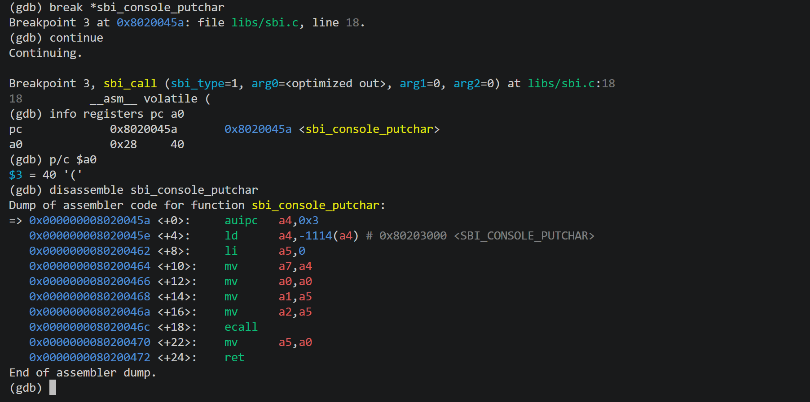

图5.2-8 SBI 输出入口的首字符与反汇编

#### 5.2.9 核实 `ecall` 前的服务编号和参数

反汇编显示，函数先读取 `SBI_CONSOLE_PUTCHAR`，通过 `mv a7,a4` 设置服务编号，将 `a1`、`a2` 置零，随后在 `0x8020046c` 执行 `ecall`。在该地址设置临时断点：

```gdb
tbreak *0x8020046c
continue
info registers pc a7 a0 a1 a2
x/i $pc
```

执行 `ecall` 前，`pc=0x8020046c`、`a7=1`、`a0=0x28`、`a1=a2=0`。其中，`a7` 保存旧版 SBI 字符输出服务编号，`a0` 保存待输出的左括号字符值，其余两个参数本次未使用。源码中的 `x17`、`x10` 分别对应 `a7`、`a0`。

本代码采用旧版 SBI Console Putchar 调用约定，不通过 `a6` 选择函数。`ecall` 用于发起环境调用，具体服务及参数由寄存器内容确定。本次调用以单个字符为单位，不直接传递整条字符串。

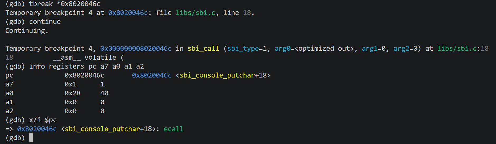

图5.2-9 ecall 前的服务编号与字符参数

#### 5.2.10 观察从内核进入固件异常入口

停在 `ecall` 前执行：

```gdb
si
info registers pc mepc mcause mtvec
x/3i $pc
```

实测结果为 `pc=0x80000474`、`mepc=0x8020046c`、`mcause=9`、`mtvec=0x80000470`。`mepc` 记录触发异常的 `ecall` 地址，`mcause=9` 表示来自 S-mode 的环境调用；`mtvec` 的低两位为 0，表明采用直接模式的异常入口。

该同步异常由内核主动请求服务触发，控制权转移至 M-mode 的 OpenSBI 处理程序。此次异常入口为 `0x80000470`，与开机时的固件启动入口 `0x80000000` 不同。

本次单步停点 `pc` 比 `mtvec` 高 4 字节。进一步执行 `x/4i $mtvec` 检查入口指令，结果见图5.2-11上半部分：

```asm
0x80000470: csrrw tp,mscratch,tp
0x80000474: sd    t0,64(tp)
0x80000478: csrr  t0,mstatus
0x8000047c: srli  t0,t0,0xb
```

第一条指令交换 `tp` 与 `mscratch`，第二条保存 `t0`，后续指令读取机器状态并右移，为检查先前特权级作准备。结合 QEMU 4.1.1 异常分派及单步处理源码，本次 `si` 在处理 `ecall` 异常后，执行了入口处第一条指令才向 GDB 返回停止状态。因此，实际单步停点为 `0x80000474`，异常入口为 `0x80000470`；二者的 4 字节差值源于入口指令已经执行，而非异常向量编号造成的偏移。

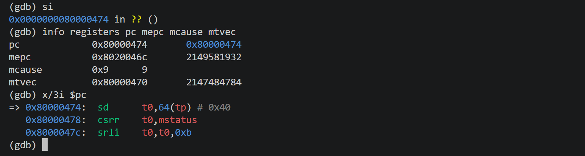

图5.2-10 ecall 的异常原因、保存地址和实际单步停点

上述单步停点的原因分析依据 QEMU 4.1.1 发布包中的 `target/riscv/translate.c`、`target/riscv/cpu_helper.c` 和 `accel/tcg/cpu-exec.c`；截图直接记录的是停止时的寄存器值及指令位置。

#### 5.2.11 验证固件处理后恢复内核执行

在当前停止位置检查异常入口，并设置返回断点：

```gdb
x/4i $mtvec
tbreak *0x80200470
continue
info registers pc mepc
x/2i $pc
```

临时断点成功命中，`pc=0x80200470`，当前指令为 `mv a5,a0`，下一条为 `ret`，表明本次 SBI 调用已返回内核。该地址比 `ecall` 所在的 `0x8020046c` 高 4 字节，对应其下一条指令。

返回内核后，查询 `mepc` 时出现以下错误：

```text
Could not fetch register "mepc"; remote failure reply '14'
```

根据 QEMU 4.1.1 源码，调试端读取 CSR 时调用 `riscv_csrrw_debug`，随后进入 `riscv_csrrw`。后者仍检查当前特权级是否满足目标 CSR 的访问要求。返回内核后，CPU 处于 S-mode，而 `mepc` 属于 M-mode 寄存器，因此本次读取被拒绝，GDB 显示错误 14。相关实现位于 `target/riscv/gdbstub.c`、`target/riscv/csr.c` 和 `gdbstub.c`。

返回断点及当前指令直接验证了 **`pc` 已恢复至 `0x80200470`**；返回后的 `mepc` 读取失败，未获得其数值。寄存器访问失败不等同于内核未恢复执行，二者分别依据错误信息和返回断点判断。

异常进入时，`mepc` 记录 `ecall` 自身的地址；固件处理完成后，需要调整恢复位置，使内核继续执行下一条指令。本次返回位置与该过程一致，但未在 `mret` 处设置断点，也未直接读取执行 `mret` 前的 `mepc`。此处地址增加 4 字节与 `ecall` 的指令长度有关，并不意味着所有 RISC-V 指令均为 4 字节。SBI 返回后的 `a0` 用于传递底层返回值，整条消息的输出计数需在 `cprintf` 返回后检查。

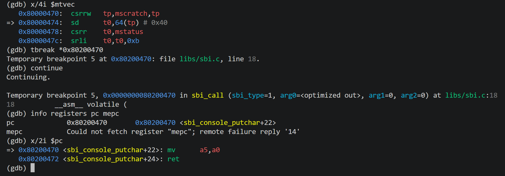

图5.2-11 异常入口补查、返回断点及返回后 mepc 读取失败

#### 5.2.12 完成整条消息并检查字符计数

为避免剩余字符再次命中 SBI 输出断点，先禁用旧断点，再在源码第 12 行 `while (1)` 设置临时断点：

```gdb
disable
tbreak kern/init/init.c:12
continue
info registers pc a0
x/2i $pc
```

断点命中 `kern_init` 的 `while (1)`，此时 `pc=0x8020003a`、`a0=0x1e`，即十进制 30。该位置位于 `cprintf` 返回之后，`a0` 保留其字符计数返回值。

消息正文 `(THU.CST) os is loading ...` 含空格共 27 个非换行字符，消息字符串另含 1 个换行，格式串追加 2 个换行，因此总计数为 `27 + 1 + 2 = 30`。字符串终止符 `\0` 不参与输出。实测计数与源码中的字符数量一致。

反汇编显示，`0x8020003a` 处为 `j 0x8020003a`，跳转目标是指令自身，对应无限循环。截图下一行显示的 `cputch` 属于相邻函数，该循环不会顺序执行至此。截图记录时，CPU 因断点暂停在循环入口。

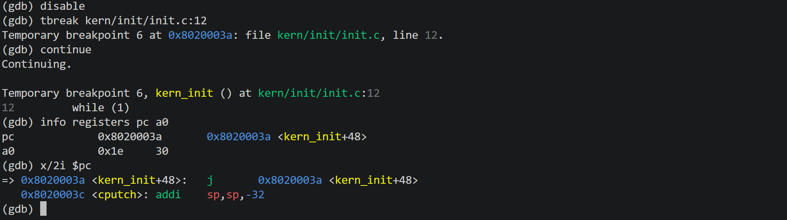

图5.2-12 到达 while 循环，cprintf 返回计数为30

图5.2-13记录运行 `make debug` 的终端输出，同时显示 QEMU 4.1.1、OpenSBI v0.4 及完整内核启动消息。字符计数反映输出回调的执行次数，结合实际终端输出可验证本次消息的输出结果。

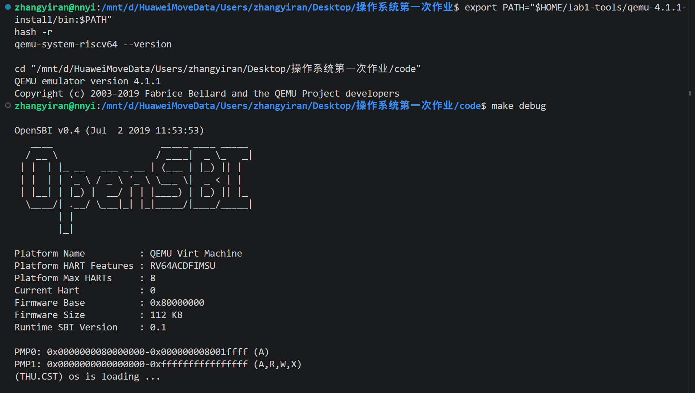

图5.2-13 同一次 GDB 调试运行中的完整启动输出

#### 5.2.13 验证结论与边界

启动阶段的实测路径为 `0x1000 → 0x80000000 → 0x80200000`。单独检查了栈初始化及进入 `kern_init`，并沿输出路径验证首字符参数、SBI 服务编号、异常原因与返回位置。

`a0` 在三个执行阶段具有不同含义：`cprintf` 入口处保存格式串地址 `0x802004c8`，执行首字符的 SBI 请求前保存字符值 `0x28`，`cprintf` 返回后保存输出计数 `0x1e`。这些数值不能脱离断点位置混为同一种参数或返回值。

本次动态验证覆盖启动消息实际使用的 `%s`、普通换行及 SBI 字符输出路径，未单独测试其他格式符、输入函数或其他 SBI 服务。返回后的 `mepc` 读取失败，也未在 `mret` 处设置断点，因此只将实际命中的返回 PC 作为恢复内核执行的直接证据。

---

### 5.3 3号成员测试与验证

**成员：** 张旗庭 2413788

本人独立完成了 Lab1 的编译运行与 QEMU + GDB 调试，并结合负责的编译链接流程，对 RISC-V 从复位入口到 uCore 内核入口的执行过程进行了实际验证。

#### 5.3.1 QEMU 正常运行

在 Lab1 目录中执行：

```bash
make qemu
```

QEMU 成功启动 RISC-V virt 虚拟机，并显示 OpenSBI 启动信息。随后终端输出：
```txt
(THU.CST) os is loading ...
```
说明内核镜像已经能够被正常加载并运行，程序最终执行到了 kern_init() 中的输出逻辑。

<p align="center">
  
</p>

#### 5.3.2 GDB 连接与复位入口验证

首先在一个终端中执行：`make debug`。随后在另一个终端中执行：`make gdb`。GDB 成功连接 QEMU 后，观察到 CPU 当前停在：`0x1000`。执行：
```gdb
i r pc
x/10i $pc
```

可以进一步观察复位后的初始指令。得到以下结果：
<p align="center">
  
</p>

#### 5.3.3 单步进入 OpenSBI
通过 `si` 单步执行复位代码，并使用：`i r t0`，`i r pc`观察寄存器变化。在执行 `jr t0` 前，观察到：`t0 = 0x80000000`。执行该跳转指令后：`pc = 0x80000000`。说明 CPU 已经从 QEMU 的复位启动代码进入 OpenSBI 固件。

<p align="center">
  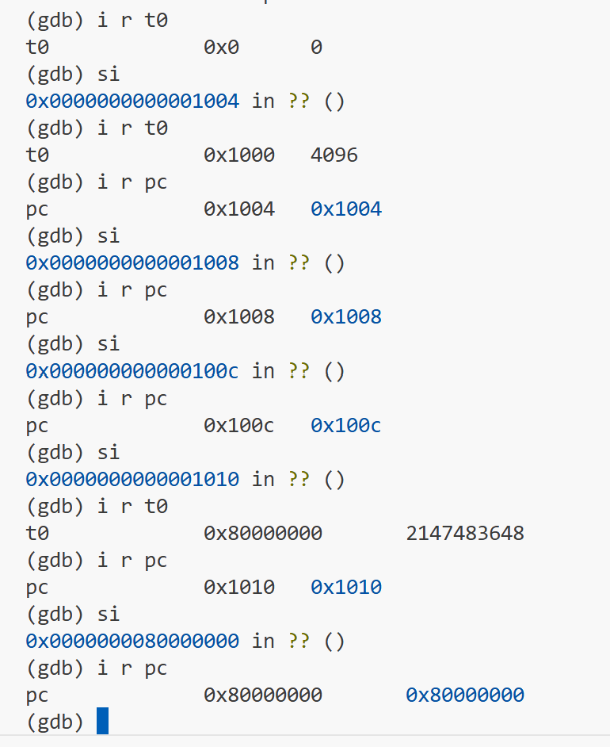
</p>

#### 5.3.4 命中 uCore 内核入口

在 GDB 中设置断点：`b *0x80200000`。随后执行：`c`。程序成功停止在：`Breakpoint 1, kern_entry () at kern/init/entry.S`。再次查看 PC：`pc = 0x80200000 <kern_entry>`。说明 OpenSBI 已经完成启动阶段的控制权交接，CPU 正式进入 uCore 内核入口。

<p align="center">
  
</p>

#### 5.3.5 验证内核栈初始化、进入 `kern_init` 与启动输出

在成功命中 `0x80200000 <kern_entry>` 后，继续对内核入口处的执行过程进行单步调试，以验证 `entry.S` 中栈初始化和进入 C 语言内核函数的过程。

首先查看当前栈指针 `sp`：`sp = 0x8001bd80`，此时程序刚刚进入 kern_entry，尚未执行 la sp, bootstacktop，因此 sp 仍保留启动阶段已有的值。随后查询 bootstacktop 的符号地址：`info address bootstacktop`，得到：`bootstacktop = 0x80203000`。这说明当前内核在 entry.S 中预留的启动栈顶部位于 `0x80203000`。

接着查看当前入口处的机器指令，la sp, bootstacktop作用是把 bootstacktop 的地址加载到栈指针 sp 中。再执行一次si，查看sp和pc，得到`sp = 0x80203000`，`pc = 0x80200004`，现在已经完成了内核栈指针的初始化，使后续 C 语言函数能够使用 uCore 自己预留的栈空间。

<p align="center">
  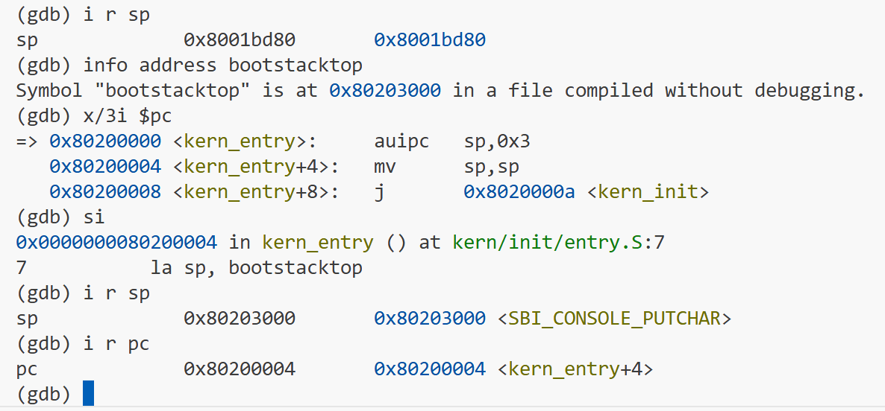
</p>

再执行si后观察到`kern_init () at kern/init/init.c:8`，`pc = 0x8020000a <kern_init>`，这说明 tail kern_init 已成功将控制权从汇编入口 kern_entry 转移到 C 语言函数 kern_init()。

<p align="center">
  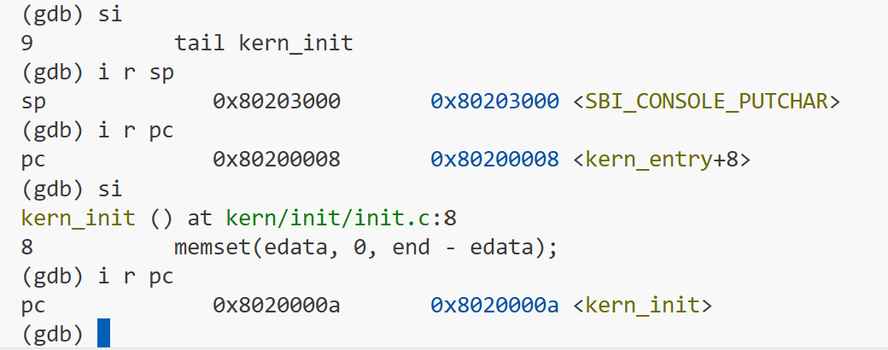
</p>

此时使用：`list`查看 kern_init() 的源码，其主要逻辑：
```c
int kern_init(void) {
    extern char edata[], end[];
    memset(edata, 0, end - edata);

    const char *message = "(THU.CST) os is loading ...\n";
    cprintf("%s\n\n", message);

    while (1);
}
```

其中`cprintf("%s\n\n", message)`用于输出内核启动信息。

为了验证程序是否确实执行到了该输出函数，在 GDB 中设置断点：`b cprintf`。让程序继续运行，最终成功停止在：`Breakpoint 2, cprintf (...) at kern/libs/stdio.c:40`。说明 kern_init() 已经实际调用了 cprintf()。

为了进一步确认当前函数调用关系，执行：bt。得到结果，这说明当前 cprintf 确实是由 kern_init() 调用进入的。回溯末尾出现：
`Backtrace stopped: previous frame inner to this frame (corrupt stack?)`并不影响上述结论。当前程序处于裸机内核启动环境，执行流由 OpenSBI 进入 uCore，并通过汇编入口和 tail 指令转入 kern_init()，并不是普通用户程序中的标准函数调用链。因此 GDB 在继续向启动阶段回溯时可能无法完整恢复更早的调用帧。

<p align="center">
  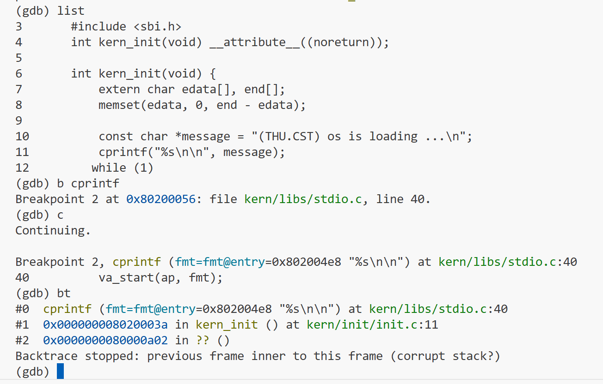
</p>

随后继续运行程序后，负责运行 QEMU 的 make debug 终端中出现了完整的 OpenSBI 启动信息，并最终输出：`(THU.CST) os is loading ...`。之所以该终端此时才出现输出，是因为 make debug 使用了 QEMU 的 -S 参数，使虚拟 CPU 启动后处于暂停状态。GDB 连接后，通过 si 和 c 等命令逐步控制虚拟 CPU 执行；当程序最终继续运行到 OpenSBI 和 uCore 的输出路径后，QEMU 终端才显示相应内容。

<p align="center">
  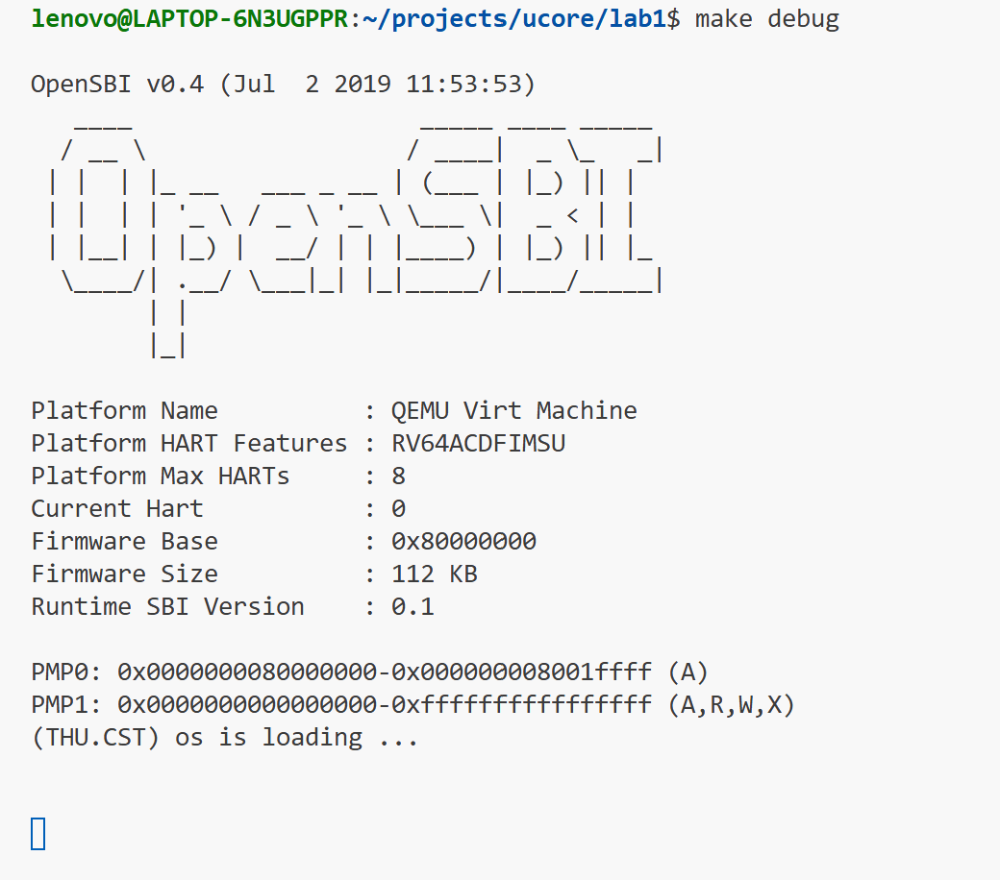
</p>

由此可以确认，uCore 在获得 CPU 控制权后，首先建立属于自身的内核栈，再从汇编入口进入 kern_init()，最终成功执行启动信息输出。该结果说明从内核入口、运行环境初始化到 C 语言内核代码执行的启动路径已经完整贯通。

#### 5.3.6 验证结论

GDB 实际观察到 CPU 复位后首先从 `0x1000` 开始执行，并通过启动代码跳转至` 0x80000000` 的 OpenSBI。随后在 `0x80200000 `成功命中 kern_entry，证明控制权已经进入 uCore。进入内核后，sp 从启动阶段已有的值切换为 bootstacktop 对应的` 0x80203000`，说明内核自己的启动栈已经建立。随后程序进入 `kern_init()`，并最终执行到 `cprintf()`，QEMU 终端成功输出：
`(THU.CST) os is loading ...`。

以上结果与 Makefile 中的加载地址、kernel.ld 中的链接地址以及 ELF 文件的入口地址相互对应，验证了本实验中内核编译、链接、加载和启动流程能够正确完成。


## 六、实验总结与收获

### 6.1 对操作系统的理解

#### 1号成员：张懿鸾 2413669

##### （1）本实验中的重要知识点及其与操作系统原理的关系

通过 Lab1，我对“操作系统启动”这一过程的理解从原先比较笼统的“QEMU 把内核运行起来”，逐渐变成了一条可以沿着代码、地址和寄存器逐步验证的执行链。

我认为本实验中比较重要的知识点主要有以下几个。

**① 操作系统并不是从 C 函数直接开始运行**

在普通应用程序中，程序员通常从 `main()` 开始考虑程序执行过程，但操作系统本身没有一个更底层的操作系统替它准备运行环境。

本实验实际观察到的启动过程是：

```text
CPU 复位
  ↓
PC = 0x1000
  ↓
OpenSBI
  ↓
0x80200000 <kern_entry>
  ↓
建立内核栈
  ↓
kern_init
```

在没有现成运行环境的情况下，内核必须逐步获得 CPU 控制权，并自行建立后续代码运行所需要的最基本条件。这和操作系统原理中“内核负责直接管理硬件资源”的概念是对应的。普通应用程序建立在操作系统提供的抽象之上，而操作系统本身则需要面对更底层的处理器、内存和机器启动过程。

---

**② 硬件、固件和操作系统内核属于不同层次**

本实验中存在三个容易混淆的概念：

```text
QEMU
  ↓
OpenSBI
  ↓
uCore
```

其中：

- QEMU 模拟 CPU、内存和外设等硬件环境；
- OpenSBI 作为固件运行在更底层的特权级，完成启动阶段的机器初始化并向内核提供 SBI 服务；
- uCore 才是本实验研究的操作系统内核。

这让我更清楚地理解了操作系统并不是直接“等同于计算机硬件”，而是运行在硬件之上的系统软件。中间还可能存在固件层，为操作系统屏蔽一部分机器级差异并提供统一接口。

---

**③ 链接地址、加载地址和实际执行地址必须相互对应**

`kernel.ld` 中规定：

```ld
ENTRY(kern_entry)
BASE_ADDRESS = 0x80200000;
```

而生成的 ELF 文件中也可以观察到：

```text
Entry point address: 0x80200000
```

最终 GDB 又实际验证 CPU 到达：

```text
0x80200000 <kern_entry>
```

通过这一过程，我开始能够区分：

```text
链接阶段
  ↓
决定程序按照什么地址布局

加载阶段
  ↓
把内核镜像放到对应的内存位置

执行阶段
  ↓
CPU 的 PC 真正到达该位置执行指令
```

程序中的地址不是随意出现的，代码的链接布局、内存中的实际位置和 CPU 的执行地址之间必须存在明确关系。

---

**④内核与普通应用程序在控制流程上存在明显区别**

当前 Lab1 的最后执行：

```c
while (1)
    ;
```

而 `kern_init()` 被声明为：

```c
__attribute__((noreturn))
```

普通应用程序通常最终会执行结束并把控制权交还给操作系统，可以执行结束并退出。但操作系统本身没有一个更高层的普通程序等待它返回。因此内核在正常情况下应该持续运行，并在后续完整系统中响应中断、异常、系统调用以及进程调度等事件。

---

##### （2）本实验尚未涉及但在操作系统原理中非常重要的内容

Lab1 只建立了一个最小可执行内核，因此操作系统中大量核心机制在本实验中还没有真正实现。我认为比较重要但本实验尚未涉及的内容包括：

- **物理内存管理**：如何记录、分配和回收实际物理页；
- **虚拟内存与页表**：如何建立虚拟地址到物理地址的映射，以及如何实现地址空间隔离；
- **异常与中断处理**：CPU 如何响应时钟、设备以及程序执行过程中产生的异常；
- **进程和线程管理**：如何创建执行实体并保存、恢复它们的上下文；
- **进程调度**：多个可运行任务之间如何分配 CPU 时间；
- **用户态与内核态隔离**：如何限制普通程序的权限，并通过系统调用进入内核；
- **同步与互斥**：多个执行流同时访问共享资源时如何保证正确性；
- **文件系统和设备管理**：如何为上层程序提供统一的数据持久化和设备访问接口。

Lab1 本身实现的操作系统功能虽然很少，但它让我第一次比较完整地理解了一个内核在没有现成运行环境的情况下，是如何从机器复位状态一步一步建立起自己的执行环境的。

---

#### 2号成员：张祎然 2412419

##### （1）本实验中的重要知识点及其与操作系统原理的关系

通过本次实验，我进一步区分了内核、固件与模拟硬件的职责。内核负责格式串解析和逐字符输出，通过 SBI 约定传递服务编号与参数；OpenSBI 在 M-mode 处理来自 S-mode 内核的请求，再通过模拟设备完成输出。这体现了接口与实现分离的思想，也说明内核向固件请求服务，与用户程序通过系统调用进入内核不是同一调用关系。

输出调用链体现了分层组织的作用。`cprintf` 提供可变参数接口，`vprintfmt` 生成字符序列，`cputch` 负责输出回调与计数，`cons_putc` 和 SBI 封装将单个字符交给底层服务。首字符值 `0x28` 用于检查单字符参数，返回计数 30 用于核对整条消息的输出回调次数；二者需要结合各自执行位置和终端结果分别解释。

对 `ecall` 的调试说明，同步异常不仅用于处理错误，也可用于受控的服务请求。异常原因、触发地址、异常入口和恢复执行位置各有不同含义。本次通过 `mcause`、异常时的 `mepc` 及返回断点检查这些关系；返回后的 `mepc` 读取失败不等于内核未恢复执行。

共同启动练习还说明，生成镜像或看到 OpenSBI 信息并不能单独证明内核已经完成启动。内核入口断点、栈指针变化和启动消息分别验证了不同阶段：入口汇编先将 `sp` 设置为 `bootstacktop`，C 函数随后使用该栈保存寄存器并完成初始化。

##### （2）本实验尚未涉及但在操作系统原理中重要的内容

本次依靠 OpenSBI 完成字符输出，并不意味着已经实现完整的设备管理或内核自身的异常与中断处理。用户态系统调用、进程调度、物理内存管理、虚拟内存与文件系统等内容仍属于后续需要学习的操作系统机制。

就本人负责的模块而言，本次只验证了启动消息实际使用的输出路径，未测试其他格式符及其他 SBI 服务。输入接口也未形成已验证的完整功能：当前 `libs/sbi.h` 声明了 `sbi_console_getchar`，但 `libs/sbi.c` 未实现该函数；未被调用的输入代码在链接时被移除，因此当前内核能够链接和输出，不能据此认定输入功能已经完成。

---

#### 3号成员：张旗庭 2413788

> 结合自己负责的编译、链接、ELF/BIN、Makefile 和 GDB 启动流程，说明本实验中的重要知识点及其与操作系统原理的关系，并补充自己认为重要但 Lab1 尚未涉及的操作系统知识点。

##### （1）本实验中的重要知识点及其与操作系统原理的关系

本实验把编译、链接、镜像生成、加载和启动这些阶段完整地串联了起来。我了解了从一些源代码变成可操作的操作系统内核，再到真正在上面执行程序的过程。

首先，我理解了 Makefile 在内核构建过程中的作用。Makefile 是用于组织整个构建流程的，我在本次实验中学习了makefile文件的基本结构，怎样定义变量，进行流程控制。在本实验中，它根据源文件、目标文件和最终目标之间的依赖关系，调用 RISC-V 交叉编译工具链完成编译、链接和镜像转换。实际构建流程可以概括为：
```text
.c / .S 源文件
    ↓
交叉编译
    ↓
.o 目标文件
    ↓
ld + kernel.ld
    ↓
bin/kernel（ELF）
    ↓
objcopy
    ↓
bin/ucore.img
```
这一过程使我认识到，操作系统内核也需要经过编译和链接，但由于内核自身负责管理运行环境，因此其链接地址、内存布局和最终加载位置必须由开发者明确控制。对于程序是如何编译的，本学期我们正在学习。但是对于程序是如何链接的问题，在得到.o文件之后，他们可能是互相调用的，所以链接并不能直接把所有连在一起，需要符号解析。

其次，我进一步理解了链接脚本 kernel.ld 的作用。链接脚本规定内核的入口符号、起始地址以及 .text、.rodata、.data、.bss 等段的布局。就是给链接器规定这些代码和数据最后应该怎么放到内存地址空间里。

本次实验规定了内核按照 0x80200000 作为起始地址进行链接，而 QEMU 在运行时又将 ucore.img 加载到同样的地址。这让我理解了“链接地址”和“实际加载地址”之间必须保持一致，否则程序内部按照链接结果生成的地址关系就可能失效。

之后，在 GDB 调试过程中，我还实际观察到了启动路径，其中 0x1000 对应 CPU 复位后的初始启动代码，0x80000000 对应 OpenSBI，0x80200000 对应 uCore 内核入口。通过单步执行，我观察到复位代码准备启动参数，并通过跳转进入 OpenSBI，随后在 kern_entry 处命中断点。这让我知道操作系统启动并不是从某个C程序直接开始执行，而是要经历硬件复位、固件初始化、控制权交接等过程，要依赖于硬件基础。

最后，在进入 kern_entry 后，我还通过 GDB 观察到 sp 被设置为 bootstacktop，随后进入 kern_init()。这让我认识到 C 语言函数能够正常执行的前提，是底层已经准备好栈等基本运行环境。也就是说，操作系统启动过程本质上是在逐步建立后续高级语言代码能够运行所需要的基础条件。

##### （2）本实验尚未涉及但在操作系统原理中重要的内容

Lab1 主要关注最小内核的构建和启动，因此很多完整操作系统中的核心机制尚未涉及。比如我们理论课最开始讲到的进程，完整操作系统需要维护多个进程或线程，并根据调度策略在不同执行任务之间切换。

同时还有理论课重点讲到的内存管理机制，页表的设计、虚拟内存等，在lab1中也没有深入地讲到。此外，中断与异常处理、系统调用、用户态与内核态切换等内容也还没有在本实验中完整展开。lab1只是一个最小可执行内核，对于我们理解操作系统是怎么组成的、工作的，继而实现更多的功能有很大的帮助。

---

### 6.2 AI 协作开发的经验

#### 1号成员：张懿鸾 2413669

Lab1 中需要实际编写的新代码很少，因此我使用 AI 的主要目的并不是让它直接生成程序，而是辅助理解实验指导书、阅读源码、拆解底层概念，并帮助设计可以验证这些理解的实验步骤。

我在本次实验中逐渐形成了一种比较稳定的 AI 协作方式：

```text
提出具体问题
  ↓
让 AI 给出解释
  ↓
回到实验指导书和源码检查
  ↓
针对不理解或存在冲突的地方继续追问
  ↓
设计实际命令或 GDB 操作进行验证
  ↓
根据真实结果修正原来的理解
```

相比于直接询问“这道题答案是什么”，我认为这种方式更适合操作系统实验，因为很多结论只有真正观察地址、寄存器和执行流程以后才能理解。所以利用AI比较可靠的方式应该是让 AI 帮助提出解释，再通过源码和实验结果判断这个解释是否成立。

另外，AI 在整理复杂执行流程方面也比较有帮助。Lab1 中涉及：

```text
编译
链接
QEMU
OpenSBI
entry.S
kern_init
SBI
GDB
```

如果分别学习这些概念，很容易把它们理解成互相独立的知识点。通过不断追问它们之间的先后关系，我逐渐把这些内容整理成：

```text
源代码
  ↓
生成内核
  ↓
QEMU 启动机器
  ↓
OpenSBI
  ↓
kern_entry
  ↓
建立栈
  ↓
kern_init
```

这一条完整主线。

同时，在使用 AI 的过程中我也发现需要注意两个问题：

1. **AI 的解释必须和当前实验源码对应。**  
   操作系统、QEMU、OpenSBI 都存在不同版本，不能因为某种说法在一般情况下成立，就直接认为它一定适用于当前实验。

2. **实验结果的优先级高于 AI 给出的推测。**  
   对地址、寄存器、伪指令展开等问题，最终都应该以实际源码、编译结果和 GDB 观察结果作为依据。

因此，我认为这次实验中 AI 最有价值的作用并不是“替我完成实验”，而是作为一个可以持续追问的辅助分析工具，帮助我形成形成自己的理解。

---

#### 2号成员：张祎然 2412419

本次与 AI 的讨论主要用于阅读输出模块源码、梳理函数调用关系，以及确定 GDB 的检查位置。对 `cprintf`、格式化回调、控制台接口和 SBI 封装，我先结合源码区分各层职责，再通过断点和寄存器验证实际参数，不将讨论中的预期直接写成实验结果。

AI 帮助我明确了同一寄存器在不同执行阶段的含义。例如，`a0` 在 `cprintf` 入口处是格式串地址，在 SBI 请求前是字符值，在 `cprintf` 返回后是输出计数。调试中需要同时记录函数入口或指令位置，不能只解释寄存器的数值。

实际结果也用于检查和修正 AI 的解释。对于执行 `ecall` 后的单步停点与 `mtvec` 相差 4 字节的问题，我补查了异常入口指令，并结合 QEMU 4.1.1 源码分析。对于返回后读取 `mepc` 失败的问题，我保留访问错误，并以返回断点和 `pc` 确认内核已恢复执行，没有将原先预期能够读到的寄存器值写成实测结果。

环境和操作安排同样需要人工核对。独立路径中的 QEMU 版本正确，不等于当前终端实际调用的版本正确；QEMU 终端与 GDB 终端承担不同任务，使用 `make debug` 暂停 CPU 后，需要通过 GDB 继续运行。函数内联和变量 `<optimized out>` 等现象则应结合本次构建的反汇编分析。

这次协作中，AI 的帮助主要体现在提出解释与验证方法，结论仍需由本人依据源码、命令结果和调试记录判断。报告分别保留直接观察结果、源码分析和未验证内容，避免将一个局部现象扩大为对整个模块的验证结论。

---

#### 3号成员：张旗庭 2413788

在本次实验中，AI给我提供了很多的帮助，让我的学习效率变得更高，同时也存在一些问题.

##### 1.给我带来的帮助

由于本次实验要自己写代码的地方很少，但是由于是第一次实验，第一次研究一个操作系统内核要怎么构建，怎么在上面实现功能，同时课程资料也比较多，可能有一些混合的地方，使用AI来帮助我理解这次实验的基本思路、所需要的前置知识、以及实验结果的原因是非常有帮助的。比如在阅读Makefile文件的时候，直接阅读对于我的难度很大，虽然在操作手册网站上有十分详尽的解释，但是对于一些我没有学习过的词汇，一些没有想到的过程，使用AI来辅助理解是非常有帮助的。

让AI来和我解释实验中的一些过程，及时性很高，而且在我没有仔细阅读完操作手册网站时，先大致了解一下实验过程，可能需要的知识，然后再去实验手册网站上寻找，会有一种完整通透的了解知识的感觉。

##### 2.存在的一些缺陷与自我反思

在实验中我也发现AI 的解释有时会基于一般性的 RISC-V 或操作系统知识，而当前实验使用的是特定版本的 QEMU、OpenSBI 和课程源码，因此不能完全依赖通用描述。例如，对于 GDB 中出现的 `unimp`、调用栈回溯异常等现象，需要结合当前实验的实际反汇编、符号表和运行结果进行判断。本次实验中，我没有直接把 AI 给出的解释作为最终结论，而是尽量通过实际源码和调试结果进行验证。

结合操作手册与对于AI使用的一般理解，正确合理的使用流程应当是
```text
提出不理解的问题
    ↓
AI 给出解释和可能的验证方法
    ↓
回到 Makefile、源码和链接脚本检查
    ↓
实际执行命令或 GDB 调试
    ↓
根据真实结果修正理解
```
AI是作为一个很好的工具来帮助我们学习理解，当然最重要的还是自己学会了多少东西。
